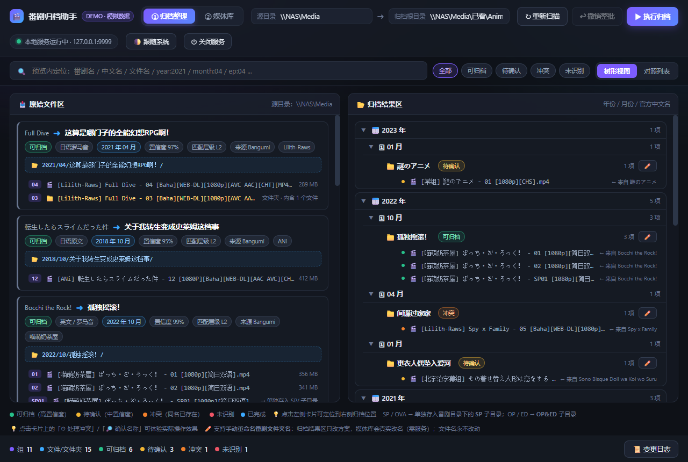
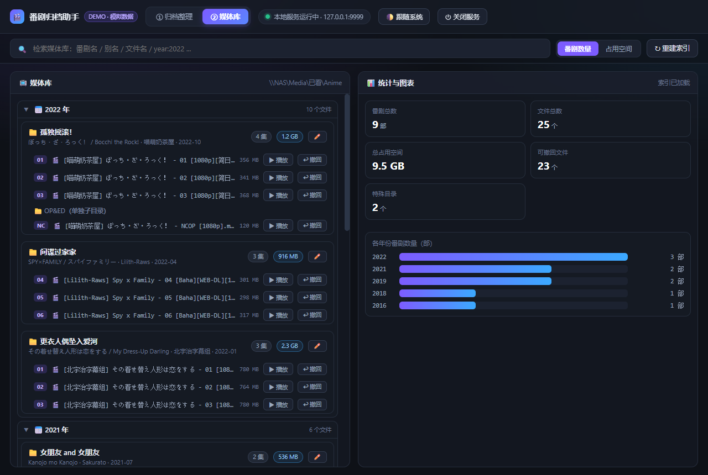

<div align="center">

# 番剧归档助手 · Anime Archive Helper - write by deepseek v4.1 Flash

**把散落在网络盘里的番剧文件，自动整理成「年份 / 月份 / 官方中文名」的媒体库** ——
归档器 + 离线媒体库二合一，面向 Windows 本地单机，后端**零运行时依赖**。



</div>

## 这个工具解决什么问题

看完的番剧往往是这样的：

```
\\NAS\downloads\           ← 一堆杂乱的文件与文件夹
  [Lilith-Raws] Full Dive - 04 [Baha][WEB-DL][1080p][AVC AAC][CHT][MP4].mp4
  [Lilith-Raws] Full Dive - 03 [Baha][WEB-DL][1080p][AVC AAC]     （文件夹）
  [喵萌奶茶屋] ぼっち・ざ・ろっく！ - 01 [1080p][简日双语].mp4
  [Nekomoe kissaten] Kimetsu no Yaiba - 02 [1080p][JPSC].mp4
  ...
```

想找一部番剧，得先猜它当初被哪个字幕组、用什么命名风格放进来了。
本工具把它们**剪切**整理成：

```
\\NAS\Anime\2022\10\孤独摇滚！\      ← 官方中文名（以 Bangumi 为准）
\\NAS\Anime\2019\04\鬼灭之刃\
\\NAS\Anime\2021\04\这算是哪门子的全能幻想RPG啊！\
```

并生成一个**可随时打开的离线网站**用来浏览、检索、看图表、播放，以及「发现自己归错了」时一键改归或撤回。

---

## ✨ 功能

### ① 归档整理（写操作，默认不执行）

| 能力 | 说明 |
| --- | --- |
| 扫描 | 递归扫描源目录（自动排除归档目录自身），**有界并发**（默认 10 路；NAS 上 8000+ 文件约 7 秒） |
| 解析 | 从文件名提取番剧名 / 集数 / 字幕组 / 分辨率 / 编码 / 语言；支持多种命名风格（含番剧名在方括号里的写法） |
| 归一化 | **三级策略**：本地别名表 → Bangumi → 本地模糊匹配；罗马音 / 英文标题先经**网页检索**还原日文原名再回查 |
| 时间旁证 | 文件修改时间参与置信度（首播不可能晚于下载时间；同季 / 同年分别加分） |
| 方案预览 | `年份/月份/番剧/SP/OP&ED/文件` 树形 + 「原路径 → 新路径」对照列表，两侧联动高亮 |
| 人工修正 | 待确认项一键确认（候选列表 / 手动输入 / 直接搜 Bangumi），结果**写回本地别名表**，下次自动命中 |
| 冲突处理 | 目标同名自动加 ` (1)` 或跳过；**没有「覆盖」这个选项** |
| 执行 | 二次确认后剪切移动；可**随时停止**、断点续传；失败自动重试 3 次并列出失败清单 |
| 撤销 | 整批撤销 + 单文件撤回（含「归档结果区就地改归」与「条目级单独调整」） |
| 秒开 | 扫描结果存快照，重开页面直接载入，不必重扫 |

### ② 媒体库（离线网站，只读浏览 + 少量写操作）



| 能力 | 说明 |
| --- | --- |
| 浏览 | `年份 → 月份 → 番剧 → 子目录 / 剧集`，**四层默认折叠**（折叠时不渲染子树，上千文件也不卡） |
| 检索 | 番剧名 / 别名（中·日·英）/ 文件名，支持 `year:2022` `month:10` `ep:01` `type:sp` |
| 排序 | 文件行**按集数数字排**（不是按文件名字符串）—— 多字幕组混排时 01 后面就是 02 |
| 图表 | 各年份番剧数量 / 占用空间分布 / 总览数字卡片（CSS 绘制，无图表库依赖） |
| 播放 | 调起 Windows 默认播放器 |
| 多选批量移动 | 勾选若干文件 → 一次性移到另一部番剧；卡片头 / 子目录行支持三态「全选」 |
| 二次整理 | 单文件 / 整目录 / 整部移动到别的番剧（真实移动，不必先撤回再归档），走**批量接口**只重建一次索引 |
| 撤回 | 单文件撤回、整批撤销、子目录整体撤回 |
| 清理 | 移动 / 撤回后自动**向上清理空目录**（绝不触碰归档根） |
| 其它 | 重命名番剧文件夹、在资源管理器中打开、文件修改时间列 |

---

## 🚀 快速开始

**环境要求**：Windows 10/11 + **Node.js 18+**（归档源与目标可以是 NAS 网络盘、也可以是本地磁盘）。

```powershell
git clone https://github.com/ayao0530/AnimeArchive.git
cd <仓库名>

# 1) 后端（编译 + 启动，默认监听 127.0.0.1:9999）
cd server
npm install
npm run build
npm start

# 2) 前端（另开一个终端）
cd ../web
npm install
npm run build        # 产物在 web/dist，由上面的本地服务托管
```

然后浏览器打开 <http://127.0.0.1:9999/>：

1. 顶栏填「源目录」与「归档根目录」；
2. 点「**↻ 扫描并生成方案**」；
3. 复核方案（黄 / 橙 / 红色的项建议先处理）→ 点「**▶ 执行归档**」；
4. 归档完成后自动重建索引，切到「② 媒体库」即可浏览。

### Windows 一键启动（可选）

```text
server\bin\create-shortcut.vbs   # 在桌面生成快捷方式（只做一次）
server\bin\start.vbs             # 启动服务 + 打开浏览器（无黑框）
server\bin\stop.bat              # 关闭服务
```

---

## 🧠 关键设计

### 归一化：三级策略 + 两级阈值

```
预处理（去标签 / 繁→简 / 季数粘合）
   ↓
① L1 本地别名表（人工确认过的结果，命中即用）
   ↓ 未命中
② L2 Bangumi（官方中文名 + 首播年月；罗马音先经网页检索还原日文原名）
   ↓ 未命中 / 证据不足
③ L3 本地模糊匹配（TokenSet + JaroWinkler + 编辑距离，取包含关系兜底）
   ↓
置信度分级：≥0.90 自动归档（绿） · 0.70~0.90 待确认（黄） · <0.70 未识别（红）
```

- **"一个名字对多季"**：名称证据无法区分季数时统一压分，改由**文件修改时间**决出唯一一条，否则如实落到「待确认」，绝不猜。
- **"更具体者胜"**：若别名表把某季的名字挂到了别的季（历史脏数据），会比较「更具体且与文件名更相似」的名字（含归档区里已存在的番剧文件夹）来纠正；写入时也会拒收这类别名。

### 安全原则（这类工具最不能出错的地方）

| 原则 | 落地方式 |
| --- | --- |
| 默认不执行 | 先出方案，点「执行」才动文件 |
| **绝不覆盖** | 同名冲突只重命名 ` (1)`；文件内容永不改写 |
| 不删文件 | 除「剪切」语义外不删除任何文件（空目录清理只删**空**目录，且不触碰归档根） |
| 目标必须在归档根内 | 执行前逐条校验；**路径拼接保住 UNC 前缀**（`\\NAS\share` 被压成 `\NAS\share` 会被 Windows 当成「当前盘符」） |
| 全程可追溯 | 每条移动都写日志（含原路径），支持整批撤销与单文件撤回 |
| 失败可恢复 | 单条失败不中断整批；自动重试 3 次；源文件保留 |

---

## 📁 项目结构

```text
.
├── server/                     本地服务（Node + TypeScript，零运行时依赖）
│   ├── src/
│   │   ├── core/               scanner / parser / grouper / normalizer / planner /
│   │   │                       executor / indexer / renamer / store / libraryMove / explorer
│   │   ├── http/server.ts      全部 API + SSE 进度 + 静态托管
│   │   ├── fsx/                文件系统封装（UNC / 长路径 / 剪切-校验-删源）
│   │   ├── util/               文本相似度 / 繁简表 / 并发池 / 时间信号
│   │   ├── cli.ts              命令行：plan / index / selftest
│   │   └── e2e.ts              端到端自检（A1–A43）
│   └── bin/                    Windows 一键启动 / 关闭 / 生成快捷方式
├── web/                        React 18 + TypeScript + Vite + Zustand
│   └── src/{views,components,api,styles}/
├── demo/index.html             静态交互 Demo（模拟数据，视觉基准）
└── docs/                       需求与设计文档 / 实施提示词 / 变更记录 / 使用与运维
```

---

## ✅ 自检

```powershell
cd server
npm run build
node dist/e2e.js      # 期望：通过 43 / 43
```

覆盖：解析 / 分组 / 方案 / 执行 / 冲突 / 撤回 / 索引 / UNC 路径 / 越界防护 /
停止与继续 / 失败重试 / 批内移位 / 空目录清理 / 多季纠偏 / 别名写入护栏 / 按集数排序 等。

---

## 📚 文档

| 文档 | 内容 |
| --- | --- |
| `docs/需求与设计文档.md` | **需求与设计基线**：要做什么、为什么这么设计、决策记录 |
| `docs/changes/` | **变更记录**（按日期分文件）：每次 bug 修复 / 新增决策，四段式「现象→原因→做法→验证」 |
| `docs/实施提示词.md` | 开工指令、验收清单（A1–A28）、坑速查 |
| `docs/使用与运维.md` | 使用与运维手册（启动 / 关闭 / 排查 / 常见坑） |

> 冲突时**以更新的为准**：`docs/changes/<更晚日期>` > `docs/changes/<更早日期>` > `docs/需求与设计文档.md` > `docs/实施提示词.md`。

---

## 🔒 隐私与安全

- 仓库内**不包含任何真实环境信息**：所有路径均为占位符（`<项目目录>`、`\\NAS\share\...`）。
- 服务只监听 `127.0.0.1`，不对外网暴露。

---

## ⚠️ 已知限制

- 仅 **Windows**（依赖 `explorer.exe` / 系统默认播放器 / 盘符语义）。
- 不重命名文件、不下载封面
- 不做目录监控（手动触发扫描）。
- 媒体库索引是**快照**：直接在 NAS 上手工增删文件后，需要点一次「↻ 重建索引」。

---
