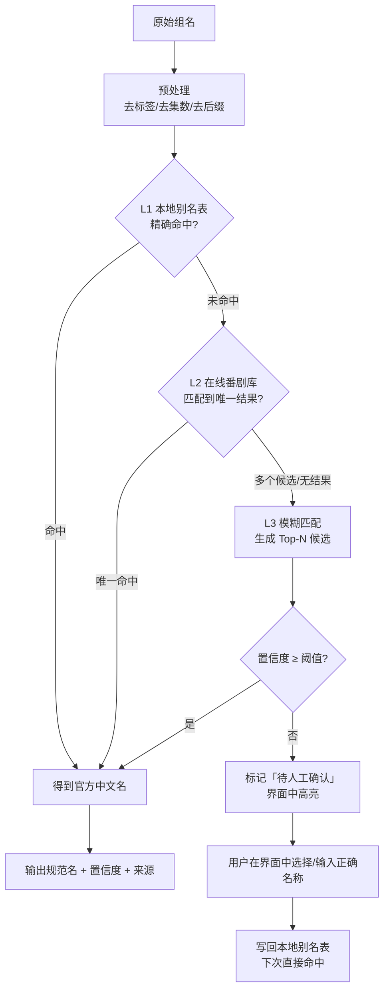
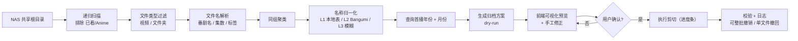
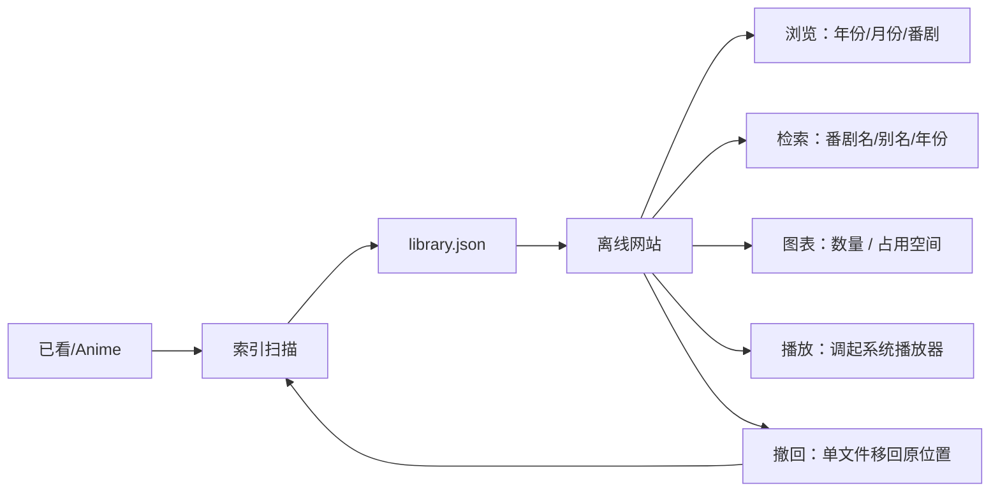
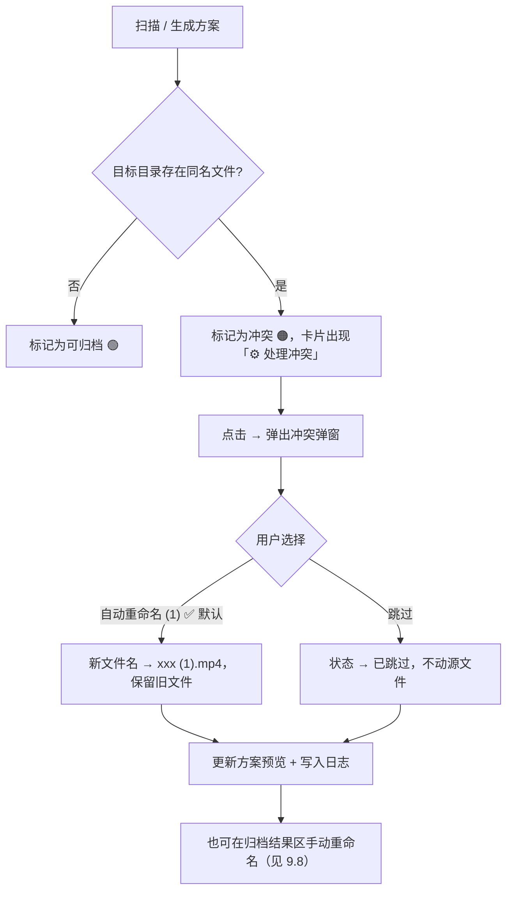
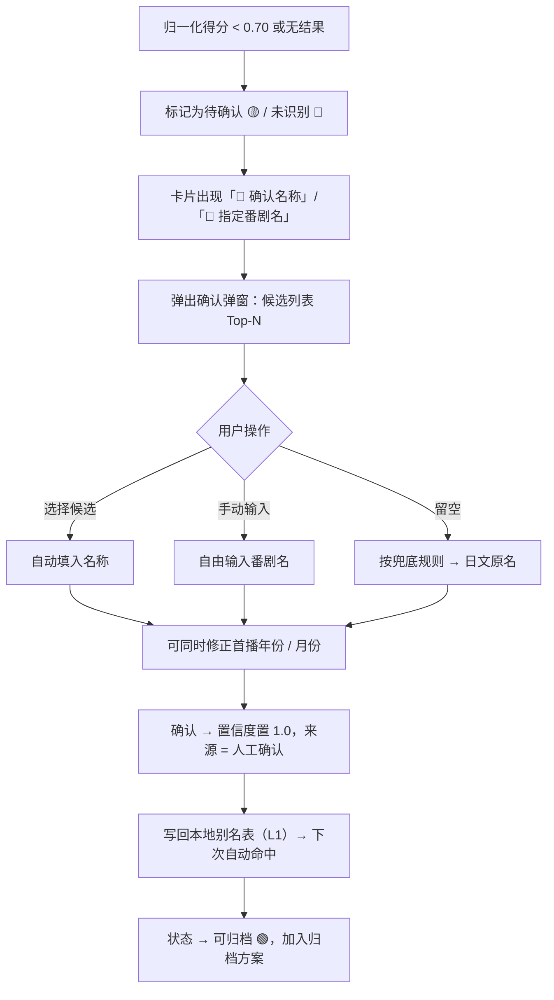
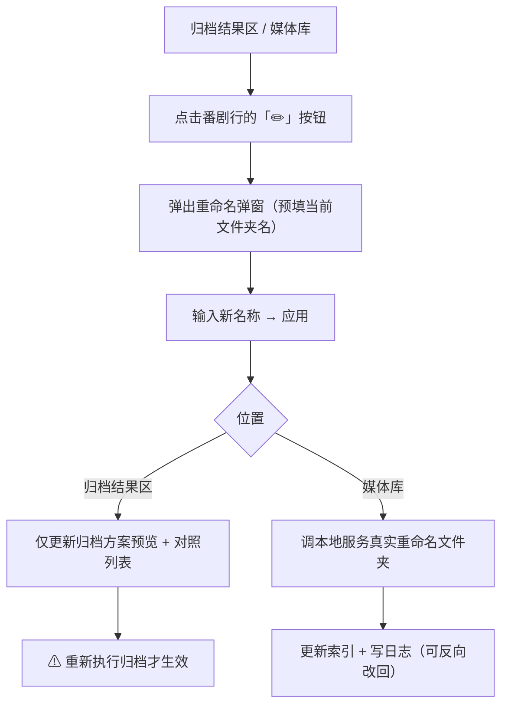

# 番剧文件自动归档工具 —— 需求说明与设计文档

| 项目 | 内容 |
| --- | --- |
| 文档版本 | **v0.7**（基线文档 · 变更记录已迁出到 `docs/changes/`） |
| 创建日期 | 2026-09-11（v0.6：2026-09-13；v0.7：2026-09-13 文档结构整理） |
| 当前状态 | ✅ **需求全部确认、M2–M7 实施完成，并已按实测反馈迭代多轮**。决策记录见 **13.1–13.4**；**实施期的 bug 修复与补充决策不在本文档**，见 `docs/changes/`（索引与效力规则见其中 `README.md`） |
| 文档定位 | ⚠️ 本文档 = **需求与设计基线**（「当初要做什么、为什么这么设计」）。<br>**改动、修复、踩过的坑一律不写在这里** —— 写到 `docs/changes/YYYY-MM-DD.md`，否则文档越堆越厚、也分不清哪条当前有效 |
| 交付物 | ① 本文档 ② 静态 Demo 演示页 `demo/index.html` ③ 实施提示词 `docs/实施提示词.md` ④ 工程代码 `server/` + `web/` ⑤ 对外说明 `README.md` + 使用与运维说明 `docs/使用与运维.md` ⑥ 变更记录 `docs/changes/` |

---

## 1. 需求理解

### 1.1 一句话概述

本项目是**「归档器 + 离线媒体库」二合一**的 Windows 本地单机工具：

- **归档器**：扫描 NAS 共享目录中「已看/Anime」**以外**的所有视频文件与文件夹，把属于**同一部番剧**的文件归为一组，把组名**统一归一化为官方中文名**（以 **Bangumi** 为准），最后按照该番剧的**播出年份 / 月份**把文件**剪切（移动）**到 `已看/Anime/{年份}/{月份}/{官方中文名}/` 中。
- **媒体库**：对归档后的 `已看/Anime` 建立**本地索引**，生成一个可**随时打开的离线网站**，支持浏览、检索、图表统计，并可直接点击**调用电脑默认播放器**观看，同时支持**单文件撤回**。

提供 React 可视化界面，让用户**直观看到「哪个文件被移动到了哪里」**。

### 1.2 使用场景

【阶段一：归档整理（剪切移动）】

```text
NAS 共享根目录  \\NAS\Media        ← 扫描范围：除「已看\Anime」外的所有视频文件与文件夹
├── [Lilith-Raws] Full Dive - 04 [Baha][WEB-DL][1080p][AVC AAC][CHT][MP4].mp4
├── [Lilith-Raws] Full Dive - 03 [Baha][WEB-DL][1080p][AVC AAC]     （文件夹）
├── [喵萌奶茶屋] ぼっち・ざ・ろっく！ - 01 [1080p][简日双语].mp4
├── 其他非视频文件（自动忽略）
└── 已看\Anime\                     ← 归档目标，扫描时自动排除
        ↓  扫描 + 解析 + 归一化 + 分组
        ↓  生成「归档方案」（移动前 vs 移动后 对照）
        ↓  用户确认（可视化预览、手工修正、进度条）
        ↓  执行剪切
已看\Anime\2021\04\这算是哪门子的全能幻想RPG啊！\
    ├── [Lilith-Raws] Full Dive - 04 [...].mp4
    └── [Lilith-Raws] Full Dive - 03 [...]\    ← 文件夹整体移入（不拆散内部文件）
```

【阶段二：媒体库浏览（离线网站）】

```text
已看\Anime  →  扫描索引  →  library.json  →  离线网站（随时可打开）
                                              ├── 浏览：年份 / 月份 / 番剧 / 剧集
                                              ├── 检索：番剧名、中文名、别名、年份
                                              ├── 图表：各年份番剧数量与占用空间
                                              ├── 播放：点击调用 Windows 默认播放器
                                              └── 撤回：单文件移回原位置
```

### 1.3 输入与输出

| 项 | 说明 |
| --- | --- |
| 扫描范围（源） | NAS 共享根目录（如 `\\NAS\Media`），**递归扫描其中除「已看\Anime」以外的所有视频文件与文件夹** |
| 归档根目录（目标） | `\\NAS\Media\已看\Anime`（NAS 上的共享文件夹，通过 SMB 访问） |
| 移动方式 | **剪切（移动）**，源文件不保留；跨盘/跨设备时自动降级为「复制 → 校验 → 删除源」 |
| 番剧数据源 | **Bangumi API**（联网查询官方中文名与首播日期），结果缓存到本地别名表 |
| 输出① | 归档后的目录结构 `{年份}/{月份}/{官方中文名}/` |
| 输出② | 归档报告 + 操作日志（含每条「原路径 → 新路径」，支持**整批撤销**与**单条撤回**） |
| 输出③ | **媒体库索引文件 `library.json`**（供离线网站读取，含番剧元数据与文件清单） |
| 输出④ | **离线网站**：浏览 / 检索 / 图表统计 / 点击播放 / 单文件撤回 |

### 1.4 需求条目

| 编号 | 需求 | 优先级 |
| --- | --- | --- |
| **R1** | 用户给定文件路径，工具递归扫描其中的视频文件与文件夹 | P0 |
| **R2** | 识别「同一部番剧」的文件夹与文件，视为**同一个组** | P0 |
| **R3** | 同名的文件整理到同一个文件夹中 | P0 |
| **R4** | 组名可能是**中文 / 日语罗马音 / 日语**，需统一归一化为**简体中文** | P0 |
| **R5** | 归一化结果**优先采用官方中文名**（如「鬼灭之刃」「孤独摇滚」） | P1 |
| **R6** | 依据番剧的**播出时间**，按**年份**（可细化到月份）再次分类 | P0 |
| **R7** | 使用 **React** 实现可视化界面 | P0 |
| **R8** | 界面需**直观展示文件被整理到哪里去了**（移动前 → 移动后 对照） | P0 |
| **R9** | 界面提供**检索功能**（**仅针对归档后的 `已看/Anime` 媒体库**，不检索待归档区域） | P1 |
| **R10** | 提供静态 Demo 演示页先行验证交互与视觉效果 | P1 |
| **R11** | 归档后对 `已看/Anime` 建立**本地索引**，生成可**随时打开的离线网站**供浏览 | P0 |
| **R12** | 媒体库中点击条目可**调用 Windows 默认播放器**播放 | P0 |
| **R13** | 支持**单文件撤回**（移回原位置），同时保留整批撤销能力 | P0 |
| **R14** | 提供**图表统计**（各年份番剧数量分布、占用空间分布） | P1 |
| **R15** | 主题**跟随系统**深色 / 浅色 | P2 |
| **R16** | 整理过程提供**进度条**（单次整理量 < 1000 个文件） | P1 |

### 1.5 明确的非目标（本期不做）

- ❌ 不做视频转码 / 压制 / 截图识别（不靠画面识别番剧）
- ❌ 不做字幕下载、重命名时间轴等后期处理
- ❌ 不做 BT/PT 下载器集成（仅处理已下载完成的目录）
- ❌ **不做自动重命名**（工具不会自己改文件名，便于做种与校验）；但✅ **支持手动重命名**（见 9.8）
- ❌ 不做网页内嵌播放器（只调用系统默认播放器，不在网页里播放）
- ❌ 不做目录监控 / 自动整理（改为**手动触发**，避免长期挂载常驻进程）
- ❌ 不做多用户 / 多设备 / 云端同步（纯本地单机）
- ❌ 不做繁体中文译名适配（统一简体中文）
- ❌ 不做超大文件量专项优化（单次整理 < 1000 个文件）
- ❌ 本期不实现完整业务代码，仅交付文档 + 静态 Demo

---

## 2. 核心概念定义

### 2.1 文件组（Group / 剧集组）

**定义**：属于**同一部番剧**的所有文件与文件夹的集合，称为一个「组」。

**判定依据（按优先级）**：

1. **归一化后的番剧名相同** → 同一组
2. 番剧名相同但**季度/续作不同** → 视为**不同组**（如「进击的巨人 第一季」与「进击的巨人 第三季」）
3. 番剧名相同但**年份跨度大**（如 2019 版 vs 2021 版同名作品）→ 视为不同组，需人工确认

> 用户给出的示例属于场景 1：
> - 文件 `[Lilith-Raws] Full Dive - 04 [Baha][WEB-DL][1080p][AVC AAC][CHT][MP4].mp4`
> - 文件夹 `[Lilith-Raws] Full Dive - 03 [Baha][WEB-DL][1080p][AVC AAC]`
> - 两者的番剧名均为 `Full Dive`，故归为**同一组**。

### 2.2 组名归一化（Normalization）

把**任意语言/任意写法的番剧名**映射为**唯一的官方简体中文名**的过程。

| 输入形态 | 示例 |
| --- | --- |
| 简体中文 | `鬼灭之刃`、`间谍过家家` |
| 繁体中文 | `鬼滅之刃`、`間諜家家酒` |
| 日语原文 | `鬼滅の刃`、`ぼっち・ざ・ろっく！` |
| 日语罗马音 | `Kimetsu no Yaiba`、`Bocchi the Rock!` |
| 英文名 | `Demon Slayer`、`SPY×FAMILY` |
| 缩写/别称 | `KnY`、`鬼灭`、`リゼロ` |

→ 全部应映射到 **`鬼灭之刃`** / **`孤独摇滚`** 这类**统一的中文规范名**。

### 2.3 播出年份 / 月份

- **年份**：番剧**首播**年份（不是下载年份、不是文件修改时间）
- **月份**：番剧首播所在月份，对应日本动画的季度划分（1/4/7/10 月为季度起点，实际首播可能在季中，以**实际首播月**为准）

### 2.4 归档根目录（NAS）

归档目标位于 **NAS 共享文件夹**中，通过 SMB 访问：

| 项 | 值 |
| --- | --- |
| 归档根目录 | `\\NAS\<共享名>\已看\Anime`（示例，实际共享名待定） |
| 容量 | 约 3 TB |
| 扫描范围 | NAS 共享根目录，但**自动排除归档根目录**（避免自我归档死循环） |

最终结构：

```text
{归档根目录}/{播出年份}/{播出月份}/{官方中文名}/{原文件或文件夹}
```

> ⚠️ 扫描时排除规则必须为「**排除归档根目录及其所有子目录**」，否则已归档的文件会被再次扫描并试图归档到自身。

### 2.5 媒体库（Media Library）

指**归档完成后**的 `已看\Anime` 目录。其特点：

- 工具会对其进行一次**索引扫描**，生成 `library.json`
- **检索功能只作用于媒体库**，不检索待归档区域
- 离线网站读取该索引，实现浏览 / 检索 / 图表 / 播放 / 撤回
- 索引来源目录 `已看\Anime` 与归档目标目录是同一个，保证「归档完就能看到」

---

## 3. 文件名解析规则

### 3.1 典型命名结构

绝大多数新番文件名遵循以下结构：

```text
[字幕组] 番剧名 - 集数 [来源][片源][分辨率][编码 音频][语言][容器].扩展名
```

对照用户示例拆解：

| 片段 | 值 | 含义 |
| --- | --- | --- |
| `[Lilith-Raws]` | `Lilith-Raws` | 字幕组 / 发布组 |
| `Full Dive` | `Full Dive` | **番剧名（关键字段）** |
| `- 04` | `4` | **集数** |
| `[Baha]` | `Baha` | 来源站点（巴哈姆特动画疯） |
| `[WEB-DL]` | `WEB-DL` | 片源类型 |
| `[1080p]` | `1920×1080` | 分辨率 |
| `[AVC AAC]` | `H.264 / AAC` | 视频编码 / 音频编码 |
| `[CHT]` | 繁体中文 | 字幕语言 |
| `[MP4]` | `mp4` | 容器格式 |

### 3.2 需要提取的字段

| 字段 | 说明 | 是否必需 |
| --- | --- | --- |
| `animeRawName` | 原始番剧名（可能含罗马音/日文/中文） | ✅ 必需 |
| `episode` | 集数（支持 `01` / `1` / `EP01` / `第01话` / `04v2`） | ✅ 必需 |
| `releaseGroup` | 字幕组 | 可选（用于展示与去重） |
| `source` / `resolution` / `codec` / `lang` | 片源、分辨率、编码、语言 | 可选（用于展示与同集去重） |
| `mediaType` | `TV` / `SP` / `OVA` / `OAD` / `OP` / `ED` / `MOVIE` / `NC` | 可选（默认 `TV`） |
| `seasonHint` | 季数提示（`S02`、`第二季`、`2nd Season`、`Part 2`） | 可选（区分续作） |

### 3.3 文件夹与文件的配对规则

需要解决的核心问题：**一个文件夹和若干文件，如何判定它们属于同一个组？**

| 规则 | 说明 |
| --- | --- |
| **R-1 名称前缀匹配** | 去除 `[...]` 标签后，取番剧名主干，做归一化 + 模糊比对（阈值可配） |
| **R-2 字幕组一致优先** | 字幕组相同时，视为同组的置信度更高 |
| **R-3 不进入文件夹内部再分组** | 若某文件夹本身就是「一部番剧的合集目录」，则**整个文件夹作为一个整体移动**，不拆散其内部文件（可配置） |
| **R-4 集数不参与分组** | 集数只用于排序与去重，不用于区分组 |
| **R-5 命名高度可疑时** | 如 `[Group] 01.mp4`（无番剧名），标记为「待确认」，交由用户手工指定 |

> 用户示例中，文件夹名 `[Lilith-Raws] Full Dive - 03 [Baha][WEB-DL][1080p][AVC AAC]` 按 R-1 + R-2 可正确与 `Full Dive - 04` 归为一组。

### 3.4 特殊文件处理

| 类型 | 示例 | 处理方式 |
| --- | --- | --- |
| SP / OVA / OAD | `xxx - SP01`、`xxx OVA` | 归入同番剧，但在番剧目录下**单独建 `SP` / `OVA` 子目录**，不并入正片 |
| OP / ED / NC | `xxx - NCED`、`xxx OP` | 归入同番剧的 **`OP&ED` 子目录** |
| 合集 | `xxx 01-12 合集` | 归入同番剧根目录，标记为「合集」 |
| 剧场版 | `xxx Movie`、`劇場版 xxx` | 剧场版在 Bangumi 是**独立条目**，**单独建目录**，年份/月份按剧场版上映时间 |
| 无法识别 | `[Group] [Unknown] [01].mp4` | 移入 `_未识别/` 目录，绝不误归档 |

**子目录结构示例**：

```text
2022\10\孤独摇滚！\
├── [喵萌奶茶屋] ぼっち・ざ・ろっく！ - 01 [1080p].mp4     ← 正片
├── SP\                                                    ← SP 单独子目录
│   └── [喵萌奶茶屋] ぼっち・ざ・ろっく！ - SP01 [1080p].mp4
└── OP&ED\                                                 ← OP/ED 单独子目录
    └── [喵萌奶茶屋] ぼっち・ざ・ろっく！ - NCOP [1080p].mp4
```

---

## 4. 名称归一化方案（核心难点）

### 4.1 三级归一化策略



| 层级 | 名称 | 手段 | 特点 |
| --- | --- | --- | --- |
| **L1** | 本地别名表 | 内置 + 用户沉淀的 `别名 → 官方中文名` 映射（JSON/SQLite） | 快、离线可用、100% 可控 |
| **L2** | 在线番剧库 | 调用 [Bangumi](https://bgm.tv)、AniList、AniDB、TMDb 等公开 API 检索 | 覆盖广，可拿到官方中文名 + 首播日期 |
| **L3** | 模糊匹配 | 字符串相似度算法生成候选，人工确认 | 兜底，避免误归 |

### 4.2 预处理（Normalize）

匹配前必须做统一化处理，否则相同作品会被判为不同：

1. 去除 `[...]` / `(...)` 内的发布信息标签
2. 去除集数段（`- 04`、`EP04`、`第4话`、`04v2`）
3. 去除常见后缀词（`BDRip`、`WEB-DL`、`1080p`、`HEVC`、`简繁日`…）
4. 统一大小写（转小写比较）
5. 全角/半角统一、中文标点转英文标点
6. 去除分隔符噪声（`.`、`_`、`-`、空格、`・`、`：`）
7. 罗马音长音符还原：`ō→ou`、`ū→uu`、`ā→aa`、`Tensei→tensei` 等
8. 日文假名 → 罗马音（或直接送入支持日文的检索接口）
9. 繁体 → 简体转换
10. 去除装饰性符号：`!`、`?`、`★`、`♪`、`～`

### 4.3 相似度算法

| 算法 | 用途 |
| --- | --- |
| 归一化编辑距离（Levenshtein） | 拼写差异、罗马音变体 |
| Jaro-Winkler | 短名称、前缀相同的情况 |
| Token Set Ratio | 词序不同、多余词（`Full Dive RPG` vs `Full Dive`） |
| 包含关系判定 | 一方是另一方的子串且长度差不大 → 高度可信 |

**建议判定规则**：`得分 = 0.5×TokenSet + 0.3×JaroWinkler + 0.2×1/编辑距离归一值`，再结合「集数是否落在合法区间」「字幕组是否一致」加权。

### 4.4 置信度分级（阈值已确认：0.70）

| 等级 | 置信度 | 界面表现 | 默认行为 |
| --- | --- | --- | --- |
| 高 | ≥ 0.90 | 绿色 ✅ | 直接进入归档方案 |
| 中 | 0.70 ~ 0.90 | 黄色 ⚠️ | 进入方案，但**需用户确认**（可一键全确认） |
| 低 | < 0.70 | 红色 ❓ | 不移动，需手工指定 |

### 4.5 命名兜底规则（已确认）

当查不到官方中文名时，按以下顺序兜底（**不接受罗马音**）：

| 优先级 | 兜底方案 | 示例 |
| --- | --- | --- |
| 1 | Bangumi 官方中文名 | `鬼灭之刃` |
| 2 | 通用译名（字幕组/民间常用译名） | `更衣人偶坠入爱河` |
| 3 | **日文原名**（兜底终点） | `その着せ替え人形は恋をする` |
| ❌ | 罗马音 | ❌ 不使用 |

### 4.6 歧义场景

| 场景 | 例子 | 处理 |
| --- | --- | --- |
| **同名不同作品** | `Fate`（系列多部）、不同年份的《猎人》 | **强制人工确认**（不自动拆分、不自动归组），由用户在候选中选择或手动指定 |
| **多季 / 续作** | `进击的巨人 3` vs `进击的巨人 The Final Season` | **各自独立文件夹**，严格按**各自的首播年份 + 月份**划分（如 `2019\04\进击的巨人 第三季\`） |
| 别名/缩写 | `リゼロ` → `Re:从零开始的异世界生活` | 别名表覆盖 |
| 中文译名不统一 | 台译「間諜家家酒」/ 陆译「间谍过家家」 | **以 Bangumi 中国大陆译名为准**，统一简体 |

### 4.7 什么是「本地别名表」？（概念补充）

#### 4.7.1 一句话解释

**别名表就是一本属于你自己的「译名字典」**：左边列出文件里可能出现的**各种写法**，
右边写好**唯一正确的官方中文名 + 首播年月**。程序每次识别番剧名时先翻这本字典，翻到了就直接用。

#### 4.7.2 为什么需要它

| 原因 | 说明 |
| --- | --- |
| **同一部作品有很多叫法** | 同一个番剧，文件名里可能是 `Bocchi the Rock!`、`ぼっち・ざ・ろっく！`、`孤独摇滚`，别名表把它们指向同一个中文名 |
| **不用每次都联网** | 查过一次就记下来，下次同一部番剧**直接命中**，速度快、断网也能用 |
| **你的修正不会白费** | 你人工确认过的名称会被记住，下次出现任何写法都会自动归到这个名字 |
| **可手工编辑** | 就是一个纯文本 JSON 文件，改错了可以直接打开改 |

#### 4.7.3 表里存什么（示意）

| 别名（任意一种写法，命中即用） | 官方中文名 | 首播年月 | 来源 |
| --- | --- | --- | --- |
| `Bocchi the Rock!` / `ぼっち・ざ・ろっく！` / `孤独摇滚！` | 孤独摇滚！ | 2022-10 | 内置 |
| `Full Dive` / `Full Dive RPG` | 这算是哪门子的全能幻想RPG啊！ | 2021-04 | Bangumi 缓存 |
| `リゼロ` / `Re:Zero kara Hajimeru Isekai Seikatsu` | Re:从零开始的异世界生活 | 2016-04 | 内置 |
| `間諜家家酒` | 间谍过家家 | 2022-04 | 人工确认写入 |

> ⚠️ **注意区分「改译名」与「改文件夹名」**：
> Bangumi 官方名可能是「孤独摇滚！」（带感叹号）。若你想要的是「孤独摇滚」，
> 应该用 **9.8 的手动重命名**去改**归档文件夹名**——这是「改名」，不是「改译名」，
> **不会影响别名表**，下次仍按官方名识别与归档。

#### 4.7.4 它在归一化流程中的位置

别名表就是 4.1 节三级策略里的 **L1 层**，优先级最高：

```text
组名 → 预处理 → ① L1 别名表（先查这里，命中即用）
                  ↓ 未命中
              ② L2 Bangumi 在线查询 → 结果自动缓存进别名表
                  ↓ 未命中
              ③ L3 模糊匹配 → 人工确认 → 写回别名表
```

#### 4.7.5 写入 / 读取时机

| 时机 | 动作 |
| --- | --- |
| 首次运行 | 载入**内置别名表**（预置常见番剧） |
| 联网查到 Bangumi 结果 | **自动缓存**写入（下次不用再联网） |
| 人工确认了名称 | 勾选「写回别名表」后**写入**（已确认：是） |
| 每次扫描命名时 | **读取**，L1 优先命中 |

#### 4.7.6 存储位置与区别

- **位置**：网站/程序目录下（如 `anime-web/data/aliases.json`）
- **格式**：纯文本 JSON，可手工编辑、可备份、可分享

| 文件 | 用途 | 作用阶段 |
| --- | --- | --- |
| `aliases.json`（别名表） | 把杂乱的名称**翻译成**官方中文名 | **归档阶段**（扫描 → 命名） |
| `library.json`（媒体库索引） | 记录归档后的**实际目录与文件** | **浏览阶段**（网站展示） |

---

## 5. 归档规则设计

### 5.1 目录结构（已确认）

```text
\\NAS\<共享名>\已看\Anime\                 ← 归档根目录
└── {播出年份}/
    └── {播出月份 两位}/
        └── {官方中文名}/                    ← 多季/续作各自独立文件夹
            ├── 正片文件 / 正片文件夹（保持原名）
            ├── SP/                          ← SP / OVA 单独子目录
            └── OP&ED/                       ← OP / ED / NC 单独子目录
```

**用户示例验证**：

| 输入 | 解析结果 | 归档目标 |
| --- | --- | --- |
| `[Lilith-Raws] Full Dive - 04 [...].mp4` | 番剧 `Full Dive`，集数 04，首播 2021-04 | `已看\Anime\2021\04\这算是哪门子的全能幻想RPG啊！\*.mp4` |
| `[Lilith-Raws] Full Dive - 03 [Baha][WEB-DL][1080p][AVC AAC]` | 同上（同一组） | 同上目录内（**整个文件夹移入**） |

> 文件夹名采用**官方中文名**（与你的回复一致）；若查不到官方中文名，则回退为**通用译名**或**日文原名**（不使用罗马音）。

### 5.2 年份 / 月份目录格式（已确认 A 方案）

| 方案 | 示例 | 说明 |
| --- | --- | --- |
| **A. 年/月（✅ 已确认）** | `2021/04/番剧名/` | 用户示例即此方案，层次清晰 |
| B. 年/季度 | `2021/2021春/番剧名/` | 备选，未采用 |
| C. 年/年-月 | `2021/2021-04 番剧名/` | 备选，未采用 |
| D. 仅年 | `2021/番剧名/` | 备选，未采用 |

### 5.3 是否重命名文件（已确认：永不改动）

- ✅ **保留原始文件名**，只做移动（便于做种、校验、回溯）
- ❌ 不提供「规范重命名」开关
- ❌ 不做集数补零处理
- ❌ **界面也不提供文件重命名入口**（Q8 已确认）—— 手动重命名**只针对番剧文件夹名**

> 例外：**冲突时的自动加 `(1)`** 是唯一会改变目标文件名的机制（由系统自动完成，非用户操作）。

### 5.4 冲突处理策略（已确认）

| 冲突类型 | 处理策略 |
| --- | --- |
| 目标目录已存在同名文件 | **自动重命名加 `(1)`**（如 `xxx (1).mp4`）—— **默认且唯一的内置策略** |
| 目标目录已存在（同组已归档） | 直接合并进已有目录，继续移动新文件 |
| 重复剧集（同集不同字幕组/分辨率） | **全部保留**，不删任何版本（文件名本身不同，不产生冲突） |
| 源路径 == 目标路径 | 跳过，避免自我移动 |
| 跨设备移动（本地 ↔ NAS） | 自动降级为「**复制 → 校验 → 删除源**」，等效于剪贴 |
| 目标路径过长 | 提前校验 Windows 260 字符限制并预警 |
| NAS 不可用 / 断开连接 | 中止本次操作，不修改任何源文件 |

**❌ 不提供「覆盖」（已确认 Q7 去掉）**，原因：有误删风险。

冲突项在界面上的可选操作仅为：

1. **✅ 自动重命名 (1)（默认）** —— 保留旧文件，新文件改名后移入
2. **⏭ 跳过** —— 不移动，原样保留在源目录

> 补充：如果两者其实是同一个文件（重复下载），用户可在**归档结果区手动重命名**后再归档（见 9.8）。

### 5.5 安全原则（必须遵守）

1. **默认 Dry-Run**：先出方案，用户点击「执行」才真正移动
2. **剪切移动**：确认后移动源文件；跨设备时先复制并校验，**校验通过后才删除源**
3. **全量日志**：记录每一次「原路径 → 新路径」+ 时间戳 + 校验结果
4. **双重撤回**：
   - **整批撤销**：一键将本批文件全部移回原位
   - **单文件撤回**：媒体库中逐个文件单独移回原位（见 8.6）
5. **失败可回滚**：单条失败不影响其他条目，失败原因单独记录，失败项不删源
6. **不删除原则**：除「剪切」语义外，工具**不会删除任何文件**（冲突文件也不删，只重命名）

> 📌 **实现期补充（以 `docs/changes/2026-09-12.md` #10 为准）**：
> ① **路径拼接绝不能压掉 UNC 前缀**（`\\NAS\share` 被压成 `\NAS\share` 会被 Windows 当成「当前盘符根」——
> 真实事故：1076 个文件 / 387 GB 被搬到本机磁盘）；统一走 `joinWinPath()`，且执行前必须校验目标在归档根内。
> ② 归档根**不自动创建**；③ 空目录清理只向上走且**绝不删归档根**；
> ④ 移动失败自动重试 3 次（共 4 次尝试）；⑤ 同一时间只允许一个归档批次。

---

## 6. 整体处理流程

【阶段一：归档整理（写操作，需确认）】



【阶段二：媒体库（读操作，随时可用）】



---

## 7. 数据结构设计

> 本节仅为**数据字段说明**，不包含实现代码。

### 7.1 扫描项 `ScanItem`

| 字段 | 类型 | 说明 |
| --- | --- | --- |
| `id` | string | 唯一标识 |
| `path` | string | 绝对路径 |
| `name` | string | 文件名/文件夹名 |
| `isDir` | boolean | 是否文件夹 |
| `size` | number | 大小（文件夹为内部合计） |
| `childCount` | number | 文件夹内文件数量 |
| `mtime` | string | 修改时间（仅展示用） |

### 7.2 解析结果 `ParsedName`

| 字段 | 说明 |
| --- | --- |
| `rawName` | 原始名称 |
| `animeRawName` | 提取出的番剧名 |
| `episode` | 集数（`number \| 'SP01'`） |
| `mediaType` | TV / SP / OVA / MOVIE / OP / ED |
| `seasonHint` | 季数提示 |
| `releaseGroup` / `source` / `resolution` / `codec` / `lang` | 标签信息 |
| `parseConfidence` | 解析置信度 |

### 7.3 组 `AnimeGroup`

| 字段 | 说明 |
| --- | --- |
| `groupId` | 组 ID |
| `rawNames` | 该组涉及的所有原始名称（可能多种写法） |
| `items` | 组内文件/文件夹列表 |
| `episodes` | 集数列表（排序后） |
| `totalSize` | 组总大小 |

### 7.4 归一化结果 `Resolution`

| 字段 | 说明 |
| --- | --- |
| `officialZhName` | **官方简体中文名**（归档目录名） |
| `alternateNames` | 别名列表（中/繁/日/罗马音/英文） |
| `year` / `month` | 播出年份 / 月份 |
| `matchLevel` | L1 / L2 / L3 |
| `dataSource` | `local` / `bangumi` / `anilist` / `manual` |
| `confidence` | 置信度 0~1 |
| `candidates` | 备选列表（Top-N，供人工选择） |
| `needReview` | 是否需人工确认 |

### 7.5 归档方案 `ArchivePlan`

| 字段 | 说明 |
| --- | --- |
| `planId` | 方案 ID |
| `sourceRoot` | 源目录 |
| `targetRoot` | 归档根目录 |
| `entries` | 条目列表（见下） |
| `stats` | 统计（总数、总大小、待确认数、冲突数、未识别数） |

### 7.6 方案条目 `PlanEntry`

| 字段 | 说明 |
| --- | --- |
| `fromPath` | 原始完整路径 |
| `toPath` | 目标完整路径 |
| `action` | `move` / `copy` / `skip` / `manual` |
| `status` | `ready` / `conflict` / `needReview` / `unrecognized` / `done` / `failed` |
| `conflictType` | 冲突类型（无 / 同名 / 已存在） |
| `note` | 备注（如「多版本」「合集」） |

### 7.7 执行日志 `OperationLog`

| 字段 | 说明 |
| --- | --- |
| `logId` / `batchId` | 日志 / 批次 ID |
| `fromPath` / `toPath` | 移动前后路径 |
| `result` | success / failed |
| `error` | 失败原因 |
| `timestamp` | 时间戳 |
| `reversible` | 是否可撤销 |
| `originPath` | 归档前的原始完整路径（**单文件撤回时使用**） |
| `opType` | `move` / `revert` / `restore`（正向 / 撤回 / 恢复） |

### 7.8 媒体库索引 `LibraryIndex`

| 字段 | 说明 |
| --- | --- |
| `generatedAt` | 索引生成时间 |
| `libraryRoot` | 媒体库根目录（`\\NAS\...\已看\Anime`） |
| `years` | 按年份分组的番剧列表 |
| `stats` | 总览统计（番剧数、文件数、总占用空间、各年份分布） |

### 7.9 索引中的番剧条目 `LibraryAnime`

| 字段 | 说明 |
| --- | --- |
| `zhName` | 官方中文名（目录名） |
| `aliases` | 别名列表（日文原名 / 常用译名 / 英文名） |
| `year` / `month` | 首播年份 / 月份 |
| `bangumiId` | Bangumi 条目 ID（用于后续补全元数据） |
| `cover` | 封面图（❌ Q2 已确认不使用，字段保留但留空） |
| `relPath` | 相对于媒体库根目录的路径 |
| `totalSize` | 占用空间 |
| `files` | 文件列表（见 7.10） |
| `subDirs` | 子目录（`SP` / `OVA` / `OP&ED` / 其他文件夹） |

### 7.10 索引中的文件条目 `LibraryFile`

| 字段 | 说明 |
| --- | --- |
| `name` | 文件名（原始名，不修改） |
| `fullPath` | 完整 UNC 路径（用于调用播放器） |
| `size` | 文件大小 |
| `type` | `video` / `other` |
| `episode` | 解析出的集数（用于排序） |
| `originPath` | 归档前的原路径（**单文件撤回用**，无则不可撤回） |
| `revertable` | 是否可撤回 |

### 7.11 撤回记录 `RevertLog`

| 字段 | 说明 |
| --- | --- |
| `revertId` | 撤回记录 ID |
| `filePath` | 当前路径 |
| `targetPath` | 回滚目标路径（归档前的原位置） |
| `result` | success / failed |
| `timestamp` | 时间戳 |
| `note` | 备注（如「原位置已存在同名文件，已重命名」） |

---

## 8. 媒体库设计（索引 / 浏览 / 播放 / 撤回）

### 8.1 总体思路

将「**归档**」与「**浏览**」两个关注点解耦：

| 阶段 | 性质 | 特点 |
| --- | --- | --- |
| 归档整理 | **写操作**（移动文件） | 需要谨慎、需人工确认、有日志、有撤回 |
| 媒体库浏览 | **读操作**（读索引） | 随时可用、打开即用、不涉及文件修改 |

两者通过**索引文件 `library.json`** 解耦连接。

### 8.2 索引生成

- **扫描对象**：`\\NAS\...\已看\Anime`（即归档后的媒体库，与归档目标同一目录）
- **产出**：`library.json`（结构见 7.8 ~ 7.10）
- **自扫内容**：目录层级（年/月/番剧）、文件名、相对路径、大小、集数
- **外部元数据**：官方中文名、别名、首播年月、封面、简介 —— 来自 **Bangumi**（归档阶段已获取并缓存，直接写入索引）
- **存放位置**：**网站目录**下（如 `anime-web/data/library.json`），随网站一起分发，打开即读（已确认）
- **触发方式**：
  1. 归档执行完成后**自动重建**
  2. 网站中手动点击「重建索引」
  3. 单文件撤回后**局部更新**

### 8.3 离线网站的形态（⚠️ 关键技术约束）

你希望的形式是「**可随时打开的离线网站，索引好后可直接点击观看（调用电脑本身播放器）**」。三种可行形态对比如下：

| 方案 | 浏览/检索 | 调用本地播放器 | 单文件撤回 | 说明 |
| --- | --- | --- | --- | --- |
| A. 纯静态网页（`file://` 双击打开） | ✅ | ⚠️ 不稳定 | ❌ | 最轻，但浏览器对 UNC 路径与跨域限制多，也无法移动文件 |
| **B. 静态网站 + 本地轻量服务（✅ 推荐）** | ✅ | ✅ | ✅ | 网站仍是静态文件；Node 小服务只监听 `127.0.0.1`，负责播放/撤回 |
| C. Electron 桌面应用 | ✅ | ✅ | ✅ | 最完整，但不再是「网站」，体积大 |

**✅ 已确认采用方案 B**（静态网站 + 本地轻量服务）：

- 平时只启动本地服务，浏览器打开网站即可浏览（纯读）
- 播放、撤回时，网页调用本地服务接口（`http://127.0.0.1:<端口>/api/...`）完成
- 要求**一键启动 / 一键关闭**（见 8.8）
- 未启动服务时仍可**只读浏览**，播放 / 撤回按钮置灰

### 8.4 播放实现

1. 索引中保存每个文件的完整 UNC 路径，如 `\\NAS\Media\已看\Anime\2022\10\孤独摇滚！\xxx.mp4`
2. **✅ 已确认：由本地服务调起播放器**（而非网页直接打开 `file://`）。点击「▶ 播放」时：
   - Node：`child_process.exec('start "" "' + fullPath + '"')`
   - 或 Electron：`shell.openPath(fullPath)`
3. ⚠️ **不建议**直接让浏览器打开 `file://` 链接：Chrome/Edge 对 `file://` → `UNC` 路径、以及 http 页面跳转 file 协议均有安全限制，体验不稳定。

### 8.5 浏览与图表

**浏览层级**：`年份 → 月份 → 番剧 → 剧集文件`（文件夹子目录如 `SP`、`OP&ED` 可展开）

> 📌 **实现期补充（以 `docs/changes/2026-09-13.md` #2 / #3 为准）**：四层（年 / 月 / 番剧卡片 / 子目录）**默认全部折叠**且折叠时不渲染子树
> （实测打开只建 245 个 DOM 节点）；检索时自动展开。文件行**按集数数字排**（多字幕组混排时 01 后面接 02）。
> 支持勾选**多选 + 批量移动**、卡片头「📂 打开文件夹」、移动后自动清理空目录。

**特殊目录分组（Q10 已确认纳入索引）**：归档根目录内的 `_未识别/` 与 `_待确认/` 也纳入媒体库索引，
在页面底部以**灰色分组**单独展示（**不参与年份图表统计**），方便后续手动归类。

| 分组 | 内容 | 可用操作 |
| --- | --- | --- |
| ⚠ `_未识别/` | 无法解析番剧名的文件 | ▶ 播放 · ✏️ 重命名文件夹 |
| ⚠ `_待确认/` | 用户选择「暂不处理」的项目 | ▶ 播放 · ✏️ 重命名文件夹 · 重新处理 |

**番剧卡片信息**：官方中文名、日文原名/别名、首播年月、集数、总大小、文件数

**图表（已确认需要）**：

| 图表 | 类型 | 说明 |
| --- | --- | --- |
| 各年份番剧数量 | 柱状图 | 直观看到追番集中的年份 |
| 各年份占用空间 | 柱状图 / 堆叠条 | 直观看到空间分布 |
| 总览统计 | 数字卡片 | 总番剧数 / 总文件数 / 总占用空间 |

### 8.6 单文件撤回（已确认需要）

| 项 | 说明 |
| --- | --- |
| 入口 | 媒体库中每个文件行右侧提供「↩ 撤回」按钮 |
| 依据 | 日志中的 `originPath`（归档前原路径） |
| 冲突 | 原位置已存在同名文件 → **自动加 `(1)`**，不覆盖 |
| 目录不存在 | 自动创建父目录 |
| 不可撤回情况 | 无 `originPath` 记录（如 NAS 上直接放入、非本工具归档的文件）→ 按钮置灰 |
| 撤回后 | 自动重建索引 + 记录 `RevertLog`（可反向恢复） |
| 整批撤销 | 保留：按 `batchId` 一键批量移回 |

### 8.7 索引更新时机

| 时机 | 动作 |
| --- | --- |
| 归档执行完成 | 自动重建索引 |
| 手动点击「重建索引」 | 全量重建（扫描整个 `已看\Anime`） |
| 单文件撤回后 | 局部更新 + 重算统计 |
| 网站打开时 | 读取现有 `library.json`；若不存在则提示先索引 |

### 8.8 一键启动与关闭（已确认需要）

设计目标：**双击一次即启动，双击一次即关闭**，不需要记命令行。

| 项 | 设计 |
| --- | --- |
| **一键启动** | 桌面提供「番剧助手.bat」快捷方式，双击后：① 后台启动本地 Node 服务（**无控制台黑框**）② 自动用默认浏览器打开网站 ③ 托盘区出现图标 |
| **一键关闭（方式一）** | 网页右上角「⏻ 关闭服务」按钮 → 调用本地服务 `/api/shutdown` 自停 |
| **一键关闭（方式二）** | 托盘图标右键 → 退出 |
| **端口** | **`9999`**（已确认 Q3）；被占用时自动 +1 并写回配置 |
| 开机自启 | ❌ 不需要（已确认 Q4），手动双击启动即可 |
| **服务未启动时** | 网站仍可打开并**只读浏览**（直接读 `library.json`），播放 / 撤回 / 重命名按钮置灰并提示「请先启动本地服务」 |

> 参考实现：Node 用 `node-windows` 注册后台服务，或用 `.vbs` 脚本以隐藏窗口方式拉起 `node server.js`。
> 网站首页地址：`http://127.0.0.1:9999`。

### 8.9 索引策略（已确认）

**结论（Q1 / Q2 已确认）：**

| 项 | 决策 | 说明 |
| --- | --- | --- |
| **文件时长** | ❌ **不显示** | 不安装 ffprobe，索引中不写入时长字段 |
| **封面** | ❌ **不下载** | 不缓存封面图，番剧卡片以纯文字 + 图标（📁）展示 |
| 索引扫描频率 | **仅索引时一次** | 打开网站只读 `library.json`，秒开，不重复扫描任何文件 |

**索引只包含这些内容（一次写入，永久复用）：**

| 内容 | 说明 |
| --- | --- |
| 目录层级 | 年份 / 月份 / 番剧文件夹 / 子目录（`SP`、`OP&ED`） |
| 文件清单 | 文件名、相对路径、大小、集数 |
| 番剧元数据 | 官方中文名、别名、首播年月、Bangumi ID（归档阶段已缓存） |

**索引重建时机**（Q6 已确认：归档完成后自动重建）：

| 时机 | 动作 |
| --- | --- |
| 归档执行完成后 | ✅ **自动重建索引**（多花几秒） |
| 手动点击「重建索引」 | 全量重建 |
| 单文件撤回 / 重命名后 | 局部更新 + 重算统计 |

> ✅ **性能优势**：因为不调 ffprobe、不下载封面，索引生成只需要本地目录遍历，
> **在 NAS 上处理 <1000 个文件通常只需 1~3 秒**，不需要「后台异步补全」这类复杂机制。

---

## 9. React 界面设计

### 9.1 页面布局（两个一级视图）

```text
┌─────────────────────────────────────────────────────────────────────┐
│ 番剧归档助手      [① 归档整理]  [② 媒体库]              [🌓 跟随系统] │
╞═════════════════════════════════════════════════════════════════════╡
│ 视图①「归档整理」                                                    │
│  [源目录 \\NAS\Media] [归档根 \\NAS\Media\已看\Anime]              │
│  [扫描] [生成方案] [执行归档] [撤销整批]                              │
│ ┌───────────────┬────────────────────────────────────────────────┐│
│ │ 左：原始文件区 │ 右：归档结果区                                  ││
│ │ Full Dive(2项) │ 2021                                            ││
│ │  04.mp4   →    │  └ 04                                           ││
│ │  03/ (文件夹) →│    └ 这算是…RPG啊！  (2 项)                     ││
│ │ ⚠ 待确认 (2)   │       ├ 04.mp4          ← 来自 Full Dive       ││
│ │ ❓ 未识别 (1)  │       └ 03/             ← 来自 Full Dive       ││
│ └───────────────┴────────────────────────────────────────────────┘│
│ 底部：[████████████░░░░░] 归档进度 68%   | 共 32 项                │
╞═════════════════════════════════════════════════════════════════════╡
│ 视图②「媒体库」（检索只作用于这里）                                    │
│  [🔍 检索番剧 / 别名 / 文件名 / year:2022]   [年份▾] [重建索引]        │
│  ┌───────────────────────────────────┐   ┌ 图表 ─────────────┐   │
│  │ 2022 / 10                          │   │ 2022 ████████ 6    │   │
│  │  ├ 孤独摇滚！   (12 集 · 4.2 GB) │   │ 2021 █████ 4        │   │
│  │  │   ├ 01.mp4      [▶ 播放][↩ 撤回]│   │ 2019 ████ 3        │   │
│  │  │   └ 02.mp4      [▶ 播放][↩ 撤回]│   └───────────────────┘   │
│  │  └ 更衣人偶坠入爱河 (12 集 · 5.1 GB)│  总览：42 部 / 613 集  │   │
│  └───────────────────────────────────┘        1.8 TB            │   │
└─────────────────────────────────────────────────────────────────────┘
```

### 9.2 功能清单

**视图① 归档整理**

| 模块 | 功能 |
| --- | --- |
| 路径选择 | 源目录（NAS 共享根）与归档根目录输入；自动排除归档目录自身 |
| 扫描 | 递归扫描并显示进度条、已发现数量、当前处理文件名 |
| 分组视图 | 按「组」展示，可展开查看组内文件；显示组名归一化前后对照 |
| 归一化展示 | 每张卡片显示 `原始名 → 官方中文名`，带置信度色块与数据来源 |
| 归档预览 | 树形展示 `年份/月份/番剧/SP/OP&ED/文件`，与左侧**双向高亮联动** |
| 方案对比 | 「列表模式」：两列 `原路径` → `新路径`，一目了然 |
| 人工修正 | 点击待确认项 → 弹出确认弹窗（候选列表 / 手动输入 / 改年份月份），确认后**写回别名表**（见 9.7.2） |
| 同名不同作品 | **强制人工确认**，不自动归组（复用同一个人工确认弹窗） |
| 冲突处理 | 点击冲突项 → 弹出冲突弹窗，**二选一：自动重命名 (1) / 跳过**（❌ 无「覆盖」，见 9.7.1） |
| **手动重命名** | 归档结果区可重命名**番剧文件夹名**（只改方案，❌ 不改文件名，见 9.8） |
| 服务状态 | 顶栏显示本地服务运行状态（端口 **9999**），提供「⏻ 关闭服务」按钮（见 8.8） |
| 执行归档 | 二次确认弹窗 + **进度条** + 结果统计（剪切移动） |
| 整批撤销 | 一键将本批文件全部移回原位 |
| 结果报告 | 成功/失败列表、导出 JSON/CSV —— ⚠️ **P7 已取消导出**（仍保留日志），此行为设计期写法 |

> 📌 **实现期补充（见 `docs/changes/2026-09-12.md`）**：
> - **秒开**：扫描成功后存快照（服务端 + 浏览器本机备份），下次打开直接载入，不必重扫
> - **方案记忆**：人工确认 / 条目级调整全部持久化，**重新扫描不会被冲掉**；
>   归档后快照会「剪裁」（已搬走的条目从待处理列表里去掉），撤回后只标「建议重扫」而不会丢
> - **可随时停止归档** + 「继续归档」；迁移失败**自动重试 3 次**，失败项单独列清单
> - **并行扫描**（默认 10 路，NAS 上 19.3s → 6.9s）；列表分批加载；归一化预计算键（77.3s → 6.0s）
> - **条目级 / 批量「分开归档」**：某几条归错了不必整组重来；执行结果区与媒体库都能改归（见 5.1.8）
> - 归档完成后**自动重建索引**；移动 / 归档后自动清理留下的空目录

**视图② 媒体库（已看/Anime）**

| 模块 | 功能 |
| --- | --- |
| 索引 | 「重建索引」按钮，扫描媒体库生成 `library.json` |
| 浏览 | `年份 → 月份 → 番剧 → 子目录/剧集` 树形或卡片式浏览 |
| 番剧卡片 | 官方中文名、日文原名/别名、首播年月、集数、总大小 |
| 检索 | 见 9.3（**仅作用于媒体库**） |
| 播放 | 点击「▶ 播放」调起 Windows 默认播放器 |
| 单文件撤回 | 每个文件行的「↩ 撤回」按钮（见 8.6） |
| **手动重命名** | 番剧卡片的「✏️」按钮，**真实重命名文件夹**（需服务开启，见 9.8） |
| 特殊目录 | `_未识别/`、`_待确认/` 以**灰色分组**展示（Q10 已确认纳入索引） |
| 图表统计 | 各年份番剧数量分布、各年份占用空间分布、总览数字 |

> 📌 **实现期补充（见 `docs/changes/2026-09-13.md` #2–#6）**：
> - 四层**默认全部折叠**（折叠时不渲染子树）；检索时自动展开，检索期间的折叠记在「覆盖」里
> - 文件行**按集数数字排**；显示修改时间；卡片头可「📂 打开文件夹」
> - **多选 + 批量移动**（勾选框 + 三态全选 + 底部选择条 + 卡片头就地入口），
>   「整部移动 / 移动整个目录 / 移动选中 N 个」三个入口文案带作用范围，**不要同名**
> - 二次移动**执行期锁界面**（进度 + 秒表 + 禁用按钮）；索引刷新失败会**重试并显示红色提示条**
> - 移动 / 撤回均会重建索引，并自动清理留下的空目录

### 9.3 检索功能设计（仅媒体库）

| 能力 | 说明 |
| --- | --- |
| **作用范围** | **仅媒体库（`已看/Anime`）**；归档整理视图的搜索框仅作「预览内定位」辅助，不属于需求中的检索 |
| 实时搜索 | 输入即过滤，防抖 200ms |
| 匹配字段 | 官方中文名、日文原名、别名（中/日/英文）、文件名、年份、月份 |
| 多语言支持 | 输入中文 / 日文 / 英文均可命中（在别名集合中检索） |
| 语法增强 | `year:2022`、`month:10`、`type:SP` |
| 结果定位 | 命中后自动展开所在年份/番剧，滚动定位 + 高亮 |
| **暂不支持** | 字幕组、分辨率、文件大小、状态检索（本期不做） |
| 空态提示 | 无结果时提示可用语法与清空筛选 |

### 9.4 视觉与状态设计

**状态颜色（归档整理视图）**

| 状态 | 颜色 | 说明 |
| --- | --- | --- |
| 可归档 | 绿色 | 高置信度（≥0.90），默认会执行 |
| 待确认 | 黄色 | 中置信度（0.70~0.90），需人工确认 |
| 未识别 | 红色 | 置信度 <0.70，不会移动 |
| 冲突 | 橙色 | 目标已存在同名，将自动加 `(1)` |
| 已完成 | 蓝色 | 已移动成功 |
| 已撤回 | 灰色 | 已移回原位 |

- **主题：跟随系统**（`prefers-color-scheme`），并提供手动覆盖（深色 / 浅色 / 跟随系统）
- 布局：顶部一级导航切换「① 归档整理」/「② 媒体库」
- 归档视图：左右双栏（原始 ↔ 归档），底部进度条
- 媒体库视图：年份分组卡片 + 番剧卡片（**纯文字，无封面**） + 剧集行
- 动效：执行归档时播放「文件飞入目标文件夹」的小动画，强化「文件去哪了」的直观感受

### 9.5 组件拆分建议

```text
App
├── TopNav               一级导航（① 归档整理 / ② 媒体库）
├── ThemeProvider        主题（跟随系统）
│
├─── 视图① 归档整理 ───────────────────────
│   ├── Toolbar          路径、扫描、生成方案、执行归档、撤销整批
│   ├── SourcePanel      左侧：原始文件分组列表
│   │   └── GroupCard    分组卡片（原名 → 中文名、置信度、文件列表）
│   ├── TargetPanel      右侧：归档结果树
│   │   └── TreeFolder   年份 / 月份 / 番剧 / SP·OP&ED 节点
│   ├── DiffList         列表模式：原路径 → 新路径
│   ├── ResolveDialog    归一化人工确认弹窗（候选选择 / 手动输入）
│   ├── ConflictDialog   冲突处理弹窗（自动重命名 (1) / 跳过）
│   ├── RenameDialog     重命名弹窗（仅番剧文件夹名）
│   └── ProgressBar      归档进度条
│
├─── 视图② 媒体库 ────────────────────────
│   ├── LibrarySearch    检索框 + 语法提示
│   ├── LibraryTree      年 / 月 / 番剧 / 子目录 树
│   │   └── AnimeCard    番剧卡片（中文名、别名、集数、大小）
│   │       └── EpisodeRow   文件行（▶ 播放 / ↩ 撤回）
│   ├── StatsOverview    总览数字卡片
│   ├── YearCharts       年份分布图表（数量 / 占用空间）
│   └── RevertDialog     单文件撤回确认弹窗
│
└─── 公共 ────────────────────────────────
    └── LogPanel         执行日志 / 撤回日志（⚠️ P7 已取消「报告导出」）
```

### 9.6 技术选型建议

| 层 | 选型 | 理由 |
| --- | --- | --- |
| 前端 | React 18 + TypeScript + Vite | 需求明确要求 React；TS 保证数据结构可控 |
| 状态管理 | Zustand | 扫描 / 方案 / 媒体库状态集中管理 |
| UI 组件 | Ant Design + Tailwind | 树、表格、弹窗开箱即用 |
| 图表 | Recharts / ECharts | 年份分布柱状图 |
| 主题 | Ant Design 暗色算法 + `prefers-color-scheme` | 跟随系统深色 / 浅色 |
| **文件系统操作** | **本地 Node 服务（仅监听 `127.0.0.1`）** | 执行剪切移动、调起播放器、单文件撤回 |
| 番剧数据 | **Bangumi API（权威源）** | 官方中文名 + 首播日期，最符合需求 |
| 播放器调起 | Node `start "" "<文件路径>"` | 调用 Windows 默认播放器 |
| 本地缓存 | SQLite / JSON | 别名表、匹配缓存、日志、媒体库索引 |

> ⚠️ **重要提示（已确认需求）：**
> 1. 纯浏览器页面**无法**移动本地文件（受沙箱限制），也无法稳定调起本地播放器。
> 2. 正式实现采用 **方案 B：静态网站 + 本地轻量 Node 服务**（见 8.3）：网站负责展示，服务负责剪切 / 播放 / 撤回。
> 3. 未启动服务时，网站仍可**只读浏览**（读 `library.json`），仅播放与撤回不可用。
>
> 📌 **实际落地（与上表有差异，完整偏差点见 `docs/使用与运维.md` §11）**：
> 未引入 Ant Design / Tailwind / Recharts / SQLite —— 前端直接复用 `demo/index.html` 的 CSS 设计令牌，
> 图表用 **纯 CSS 柱状图**，索引与缓存都是 **JSON**，后端 **零运行时依赖**（只用 `node:http`/`node:fs`/`node:https`）。

### 9.7 冲突处理与人工确认的交互流程（Demo 已实现）

#### 9.7.1 冲突处理流程（目标已存在同名文件）



**弹窗线框**：

```text
┌─ ⚙ 冲突处理 · 目标已存在同名文件 ─────────────────────┐
│ ⚠ 目标目录中已存在同名文件，请选择处理方式               │
│                                                          │
│ 目标目录  \\NAS\Media\已看\Anime\2022\04\间谍过家家\     │
│ 已存在    [Lilith-Raws] Spy x Family - 05 [...].mp4      │
│           298 MB · 2022-04-12 20:14                      │
│ 待移入    [Lilith-Raws] Spy x Family - 05 [...].mp4      │
│           298 MB · 刚刚下载                                │
│                                                          │
│ ┌ ◉ 自动重命名 (1)                            推荐 ┐     │
│ │   保留旧文件，新文件重命名为 ... (1).mp4 后移入   │     │
│ ├ ○ 跳过                                             ┤     │
│ │   不移动该文件，保留在源目录                       │     │
│                                                          │
│ ℹ 不提供「覆盖」选项（避免误删）；如需改其他名字，       │
│   可关闭本窗后在归档结果区手动重命名                    │
│                                                          │
│                          [ 取消 ]  [ 应用 ]              │
└──────────────────────────────────────────────────────┘
```

#### 9.7.2 人工确认流程（置信度不足 / 无法识别）



**弹窗线框**：

```text
┌─ 🔎 人工确认番剧名 · 原始名「Sono Bisque Doll wa Koi wo Suru」 ─┐
│ ⚠ 置信度 88% 低于阈值，请从候选中选择或手动输入                   │
│                                                                  │
│ 原始组名   Sono Bisque Doll wa Koi wo Suru                       │
│ 匹配层级   L3 · 来源 AniList                                     │
│                                                                  │
│ ┌ ◉ 更衣人偶坠入爱河           Bangumi（中国大陆译名） 相似度 88% ┐│
│ ├ ○ 恋上换装娃娃               台译                    相似度 81% ┤│
│ ├ ○ その着せ替え人形は恋をする  日文原名                相似度 72% ┤│
│ └ ○ ✏️ 手动输入                                                 ┘│
│                                                                  │
│ 番剧名     [更衣人偶坠入爱河                              ]       │
│ 首播年份   [2022]      首播月份  [01]                            │
│ ☑ 写回别名表（下次遇到相同名称直接命中 L1）                       │
│                                                                  │
│                        [ 取消 ]  [ 确认并加入归档方案 ]           │
└────────────────────────────────────────────────────────────────┘
```

**规则**：

- 留空 + 非未识别 → 按 4.5 兜底规则使用**日文原名**
- 未识别项（置信度 <0.70）→ **必须**填写番剧名与年份/月份，否则保持 `_未识别/`
- 确认后**置信度置为 1.0**，来源标记为「人工确认」，状态转为**可归档**
- 勾选「写回别名表」→ 写入本地 L1 表，**下次直接命中**（已确认：需要）

### 9.8 重命名功能（仅限番剧文件夹名，已确认）

> **Q8 已确认：只需要更改「番剧文件夹的名字」**，其他地方都不涉及改名。
> 例：媒体库里 `孤独摇滚！` 想改成 `孤独摇滚`。
>
> 与决策 #13 的关系：「不重命名」指**工具不会自动改文件名**；
> 手动重命名**仅限番剧文件夹**，文件名与 `年份/月份` 层级都不动。

#### 9.8.1 两处入口与区别

| 位置 | 可重命名对象 | 性质 | 需要本地服务 |
| --- | --- | --- | --- |
| **① 归档结果区（预览）** | **番剧文件夹名** | 只修改**归档方案**，不碰磁盘 | ❌ 不需要 |
| **② 媒体库（已归档）** | **番剧文件夹名** | **真实重命名** NAS 上的文件夹 | ✅ 需要 |
| ❌ 文件名 | 不提供入口 | 永远保持原文件名 | — |
| ❌ `年份/月份` 层级 | 不提供入口（Q9 已确认） | 目录结构不变 | — |

#### 9.8.2 交互流程



#### 9.8.3 弹窗线框

```text
┌─ ✏️ 重命名归档后的文件名 ──────────────────────────┐
│                                                      │
│ 位置      \\NAS\Media\已看\Anime\2021\04\这算是…\  │
│ 原文件名  [Lilith-Raws] Full Dive - 04 [...].mp4      │
│ 新文件名  [Lilith-Raws] Full Dive - 04 [BD][1080p].mp4]│
│                                                      │
│ ℹ 「不自动重命名」指工具不会自己改名；这里是你手动  │
│   指定的名称，仅影响归档方案，不会动源文件            │
│                                                      │
│                        [ 取消 ]  [ 应用 ]           │
└────────────────────────────────────────────────┘
```

#### 9.8.4 规则

| 规则 | 说明 |
| --- | --- |
| **唯一对象** | **只允许改番剧文件夹名**（`{年份}/{月份}/<番剧文件夹>` 的最后一层） |
| 年份 / 月份 | ❌ 不可改（Q9 已确认） |
| 文件名 | ❌ 不可改，**永远保持原文件名**（除冲突时系统自动加 `(1)`） |
| 预填 | 打开时预填当前文件夹名 |
| 非法字符 | 校验 Windows 禁用字符，且不能为空 |
| 重名检测 | 若同目录下已存在同名文件夹 → 提示并拒绝（防止覆盖） |
| 典型用途 | 去掉多余标点（`孤独摇滚！` → `孤独摇滚`）、修正译名、统一命名风格 |
| 记录日志 | 媒体库的重命名写入 `RenameLog`，支持反向改回 |
| 服务未启动 | 媒体库侧「✏️」置灰；归档结果区侧仍可用（只改方案） |

---

## 10. 静态 Demo 演示页说明

**文件位置**：`demo/index.html`（单文件，双击即可在浏览器打开，无任何依赖）

**定位**：Demo 仅用于**验证交互与视觉效果**，使用模拟数据，**不执行任何真实文件操作**。正式实施时再改为 React 工程（已确认）。

**演示内容**：

【视图① 归档整理】

1. 顶部工具栏：源目录（`\\NAS\Media`）/ 归档根目录（`\\NAS\Media\已看\Anime`）、扫描、执行归档、撤销
2. 左侧「原始文件区」：按组展示，卡片显示 **`原始名 → 官方中文名`** 归一化过程、置信度、数据来源、目标路径
3. 右侧「归档结果区」：`年份/月份/番剧/文件` 树形结构
4. **双向联动**：点击左侧卡片 → 右侧对应目录滚动定位并高亮闪烁
5. 「**对照列表**」视图：完整 `原路径 ➜ 归档后路径`
6. 「执行归档」：模拟剪切过程 + 进度条 + 变更日志抽屉
7. 底部统计：组数、文件数、可归档、待确认、冲突、未识别
8. 「↩ 撤销整批」：一键撤销

【视图② 媒体库（新增）】

9. 归档后媒体库浏览：`年份 → 月份 → 番剧 → 子目录/剧集`
10. **检索**（仅媒体库）：番剧名 / 别名 / 文件名 / `year:2022`
11. **图表**：各年份番剧数量、占用空间分布、总览数字卡片
12. **▶ 播放**：模拟调起 Windows 默认播放器（Demo 中以提示条反馈）
13. **↩ 撤回**：单文件撤回（Demo 中模拟移回并在日志中记录）

【交互流程演示（本次新增，直接点击卡片按钮体验）】

14. **⚙ 冲突处理**：点击冲突项（间谍过家家）卡片上的「⚙ 处理冲突」→ 弹出**二选一**弹窗（自动重命名 (1) / 跳过，**❌ 无「覆盖」**），选择后**卡片状态、目标文件名、日志实时更新**
15. **🔎 人工确认**：点击待确认项（更衣人偶 / 女朋友 and 女朋友 / 謎のアニメ）或未识别项的「🔎 确认名称」→ 弹出候选列表 + 手动输入 + 年份月份修正 + 写回别名表，确认后状态转为**可归档**
16. **⏻ 一键启动 / 关闭服务**：顶栏显示本地服务状态，点「关闭服务」后播放/撤回按钮置灰，再点「启动服务」恢复
17. **主题跟随系统**：顶栏主题按钮循环「跟随系统 → 深色 → 浅色」
18. **✏️ 手动重命名番剧文件夹**：① **归档结果区**的番剧行点「✏️」可修改**目标文件夹名**（只改方案，立即反映到对照列表与日志；❌ 文件名不可改）；② **媒体库**的番剧卡片点「✏️」可**真实重命名文件夹**（需服务开启，关闭服务时置灰，实测可把「孤独摇滚！」改成「孤独摇滚」）；③ `_未识别` / `_待确认` 两个特殊目录已纳入媒体库，以**灰色分组**展示（不参与图表统计）

**演示数据示例**：

| 原始名称（模拟） | 语言形态 | 归一化中文名 | 播出时间 | 归档目标 |
| --- | --- | --- | --- | --- |
| `[Lilith-Raws] Full Dive - 04 [...]` + 文件夹 `- 03` | 罗马音 | 这算是哪门子的全能幻想RPG啊！ | 2021-04 | `2021/04/…` |
| `[ANi] 転生したらスライムだった件 - 12 [...]` | 日语 | 关于我转生变成史莱姆这档事 | 2018-10 | `2018/10/…` |
| `[喵萌奶茶屋] ぼっち・ざ・ろっく！ - 01 [...]` | 日语 | 孤独摇滚！ | 2022-10 | `2022/10/…` |
| `[喵萌奶茶屋] ぼっち・ざ・ろっく！ - SP01 [...]` | 日语 | 孤独摇滚！ | 2022-10 | `2022/10/…/SP/` |
| `[Lilith-Raws] Spy x Family - 05 [...]` | 英文 | 间谍过家家 | 2022-04 | `2022/04/…` |
| `[Sakurato] Bokutachi wa Benkyou ga Dekinai - 01 [...]` | 罗马音 | 我们无法一起学习 | 2019-04 | `2019/04/…` |
| `[Nekomoe kissaten] Kimetsu no Yaiba - 02 [...]` | 罗马音 | 鬼灭之刃 | 2019-04 | `2019/04/…` |
| `[北宇治字幕组] その着せ替え人形は恋をする - 03 [...]` | 日语 | 更衣人偶坠入爱河 | 2022-01 | `2022/01/…` |
| `[某组] 謎のアニメ - 01 [...]` | 日语 | 謎のアニメ（**无中文译名，兜底为日文原名**） | — | `_待确认/` |
| `[Group] [Unknown] - 01.mp4` | 未知 | ❓ 未识别 | — | `_未识别/` |

---

## 11. 性能与可靠性

| 项 | 措施 |
| --- | --- |
| 扫描量 | 单次 < 1000 个文件，无需虚拟滚动，提供进度条即可 |
| NAS 扫描延迟 | 网络目录遍历较慢；扫描时显示「正在扫描 xxx」当前项，避免假死感 |
| 在线查询 | Bangumi 并发限流（如 3 QPS）+ 本地缓存；离线时自动降级到 L1/L3 |
| 剪切安全 | **本场景源与目标均在 NAS 上（已确认），属于同设备移动，直接 Move，速度很快**；跨设备降级逻辑仅作兜底保留 |
| NAS 断连 | 操作前先探测归档根目录可写；失败则中止，**不修改任何源文件** |
| 长路径 | 归档路径可能较长，提前校验 Windows 260 字符限制并预警 |
| 失败隔离 | 单条失败不中断整批，记录原因并可重试 |
| 可追溯 | 每次批量操作生成可撤销日志；单文件撤回单独记录 |

> 📌 **实现期实测（见 `docs/changes/2026-09-12.md` 第五节）**：
>
> | 项 | 优化前 | 优化后 |
> | --- | --- | --- |
> | 扫描 NAS 8236 文件（并发 1 → 10） | 19.3 s | **6.9 s** |
> | 归一化 L3 模糊匹配（重复算 `aliasKey`） | 77.3 s | **6.0 s** |
> | 整轮扫描（含联网 + 方案 + 快照） | 137 s | **25 s** |
> | 列表 DOM 节点（8286 个文件行） | 53,782 | **7,809** |
>
> ⚠️ 「单次 < 1000 个文件」这个前提**实际不成立**（真实媒体库 8425 个文件 / 709 部）——
> 所以后来补了并发扫描、折叠不渲染、列表分批、预计算键等优化，完整清单见 `docs/changes/2026-09-12.md`。

---

## 12. 里程碑建议

| 阶段 | 内容 | 产出 |
| --- | --- | --- |
| M0 | 需求确认（✅ 已完成） | 本文档 v0.2 |
| M1 | 静态 Demo 交互验证（✅ 已完成） | `demo/index.html` |
| M2 | 核心引擎：扫描（排除 Anime）+ 解析 + 本地别名表 + 归档方案 JSON | 可输出归档方案 |
| M3 | 接入 Bangumi API + 模糊匹配 + 置信度阈值 0.70 | 归一化准确率达标 |
| M4 | 本地 Node 服务：剪切移动、进度条、日志、整批撤销 / 单文件撤回 | 可真实执行归档 |
| M5 | React 界面①：归档整理（预览、人工修正、进度、日志） | 可用归档 MVP |
| M6 | 索引生成器 + React 界面②：媒体库（浏览、检索、图表、播放、撤回） | 可用媒体库 MVP |
| M7 | 打磨：一键启动/关闭（端口 9999）、主题跟随系统、NAS 异常处理、手动重命名 | 正式发布版 |

> 📌 **交付方式（已确认）**：M2–M7 **一次性全部交付**，不分批、不逐阶段等确认。
> 里程碑编号仅作为**任务分组**与**自检清单**，不作为交付闸门。
> 具体执行顺序、硬性约束、总验收清单（A1–A28）见 `docs/实施提示词.md`。
>
> ✅ **实施状态（2026-09-13）**：M2–M7 **已全部完成**，自检 **A1–A43 全部通过**。
> 之后的每一条实测反馈（含 2 次严重事故）的修复与新增决策均记录在 **`docs/changes/`**（按日期归档），
> 使用与运维说明见 `docs/使用与运维.md`。

---

## 13. 决策记录与遗留问题

> 本章由原「待确认问题」演化而来。你已逐条答复，现整理为**决策记录**，作为实现依据。原始问答记录折叠在文末附录中。

### 13.1 决策记录（已确认）

| # | 事项 | 决策 |
| --- | --- | --- |
| 1 | 文件夹命名 | **官方中文名**；无中文译名则回退**日文原名** |
| 2 | 目录层级 | 保持 `年份/月份/番剧名` |
| 3 | 是否保留月份 | ✅ **保留月份** |
| 4 | 多季 / 续作 | **各自独立文件夹**，严格按「首播年份 + 月份」划分 |
| 5 | 特殊内容 | SP / OVA / OP / ED / NC **单独建子目录**；剧场版按独立条目单独建目录 |
| 6 | 同名不同作品 | **强制人工确认**，不自动归组 |
| 7 | 数据源权威 | **Bangumi**（官方中文名 + 首播日期） |
| 8 | 联网 | **需要**（详见 13.1.1） |
| 9 | 置信度阈值 | **0.70**（≥0.90 绿 / 0.70~0.90 黄 / <0.70 红） |
| 10 | 别名表沉淀 | ✅ 人工确认结果**写回本地别名表** |
| 11 | 语言 | **简体中文**，暂不需要繁体 |
| 12 | 译名兜底 | 可接受**通用译名**与**日文原名**；❌ **不接受罗马音** |
| 13 | 文件重命名 | ❌ **不重命名**，保留原始文件名 |
| 14 | 同名冲突 | **自动加 `(1)`** |
| 15 | 同集多版本 | **全部保留** |
| 16 | 源文件 | **剪切（移动）**，源文件不保留 |
| 17 | 归档根目录 | NAS 的 `已看/Anime`；**扫描范围为 Anime 以外的所有文件与文件夹** |
| 18 | 撤销 | ✅ 需要；且支持**单独撤回某一个文件** |
| 19 | 运行形态 | 可**随时打开的离线网站**，索引好后点击调用系统播放器 |
| 20 | 目标平台 | **仅 Windows** |
| 21 | 文件规模 | **< 1000**，提供**进度条**即可 |
| 22 | 目录监控 | ❌ 不实现（详见 13.1.2），改为**手动触发** |
| 23 | 多用户 | **纯本地单机** |
| 24 | 检索维度 | 暂不需要字幕组 / 分辨率 / 大小 / 状态 |
| 25 | 图表统计 | ✅ 需要 |
| 26 | 主题 | **跟随系统** |
| 27 | Demo 页 | 保持**静态 HTML**，正式实施时再做 React 工程 |

#### 13.1.1 关于「联网的目的是什么？」（原 Q8）

联网**只做一件事**：查询 **Bangumi**，拿到两样本地拿不到的东西：

1. **官方简体中文名** —— 把你文件里的罗马音 / 日文 / 英文名翻译成规范中文名
2. **首播年份 + 月份** —— 决定归到哪个 `年份/月份` 目录

如果不联网，这两项只能靠内置别名表覆盖，覆盖率低、新番必然缺失 → **因此建议联网**。

联网是**低频且可选**的：查询结果会缓存进本地别名表，同一部番剧只查一次；断网时自动降级到 L1/L3（准确率下降，但程序照常运行）。

#### 13.1.2 关于「监控目录是否需要长期挂载？」（原 Q22）

是的，目录监控需要**常驻进程**（必须一直后台运行才能发现新文件），代价是开机自启 + 长期占用资源。

结合你的场景（单次 < 1000 个文件、手动整理），**结论：不实现目录监控，改为手动触发**——点一次「扫描」即可。

### 13.2 遗留问题答复记录（P1–P8，已确认）

| # | 问题 | 你的答复 | 最终决策 |
| --- | --- | --- | --- |
| P1 | NAS 共享的具体路径 / 共享名？ | 真实路径和目标路径我自己输入就可，遇到需要输入账号密码的情况我再处理 | **界面提供两个路径输入框**，不写死路径、不做凭据管理；自动记住上次输入 |
| P2 | 是否接受「静态网站 + 本地轻量服务」？ | 带服务的吧，但希望可以简单的一键启动和关闭 | ✅ **方案 B + 一键启动/关闭**（见 8.8）：桌面快捷方式启动，网页「⏻ 关闭服务」按钮关闭 |
| P3 | 播放方式？ | 由本地服务调起播放器 | ✅ 见 8.4 |
| P4 | 归档后源目录里剩余的非视频文件与杂物？ | 不处理 | ❌ 不实现清理逻辑，**原样保留** |
| P5 | `library.json` 存放位置？ | 网站目录 | ✅ 存**网站目录**（如 `anime-web/data/library.json`） |
| P6 | 索引是否需要文件时长与封面？ | *（反问：时长是否只扫描一次即可？还是每次打开都要重新扫描？）* | **只需扫描一次**，写入索引后永久复用；详见 **8.9**（含「先出索引、后台补时长」方案）。⚠️ **后由 Q1 明确：不装 ffprobe、索引不含时长字段**，Q1 优先 |
| P7 | 归档报告是否需要 CSV / Excel 导出？ | 不需要 | ❌ 取消导出模块（仍保留日志） |
| P8 | 跨设备剪切慢的问题？ | 都在 nas 上 | ✅ 属于**同设备移动**，直接 Move，速度很快；跨设备降级逻辑仅作兜底保留 |
| — | Demo 补充需求 | 希望看到「冲突」和「待确认」项的实际操作效果 | ✅ 已在 Demo 中实现，详见 **9.7** 与第 10 章第 14、15 条 |

### 13.3 遗留问题答复记录（Q1–Q7 + 新增需求，已确认）

| # | 问题 | 你的答复 | 最终决策 |
| --- | --- | --- | --- |
| Q1 | 是否安装 ffprobe 以显示文件时长？ | 不装，暂不显示时长 | ❌ **不显示时长**，索引中不含时长字段 |
| Q2 | 封面是否下载并缓存？ | 不需要 | ❌ **不使用封面**，番剧卡片纯文字展示 |
| Q3 | 本地服务端口？ | 用 9999 | ✅ 端口改为 **`9999`**（占用时自动 +1） |
| Q4 | 本地服务是否开机自启？ | 否 | ❌ 不设开机自启，手动双击启动 |
| Q5 | `_待确认/` 与 `_未识别/` 目录位置？ | 归档目录里面 | ✅ 放**归档根目录内**：`已看/Anime/_待确认/`、`已看/Anime/_未识别/` |
| Q6 | 归档完成后自动重建索引？ | 可以 | ✅ **自动重建索引** |
| Q7 | 是否保留「覆盖」选项？ | 去掉吧，默认重命名 | ❌ **去掉「覆盖」**；冲突处理只剩「自动重命名 (1)」与「跳过」 |
| — | 新增需求：归档结果区支持重命名 | 归档后的结果区能否支持重命名，方便修改 | ✅ 新增 **9.8 手动重命名**（归档结果区 + 媒体库两处） |

### 13.4 遗留问题答复记录（Q8–Q10，已确认）

| # | 问题 | 你的答复 | 最终决策 |
| --- | --- | --- | --- |
| Q8 | 媒体库是否也支持重命名？重命名哪些东西？ | 我只需要更改**文件夹**的名字，比如 demo 中孤独摇滚是「孤独摇滚！」，我希望改成「孤独摇滚」，其他地方不涉及到改名字 | ✅ **只允许重命名番剧文件夹名**；❌ 文件名不提供改名入口；❌ `年份/月份` 层级不可改 |
| Q9 | 是否允许改 `年份/月份` 层级？ | 不涉及到这一层修改 | ❌ **不可改**，只改最后一层文件夹名 |
| Q10 | `_待确认/` 与 `_未识别/` 是否纳入媒体库索引？ | 纳入 | ✅ **纳入索引**，页面底部以**灰色分组**单独展示（不参与年份图表统计） |

> ✅ **至此所有需求问题均已确认，设计定稿（v0.5）。**

---

### 13.5 实施期变更记录

> ⚠️ **本节的变更记录已迁出到独立目录**，本文档只保留「需求与设计基线」，不再堆积改动 ——
> 否则文档会越来越厚、也分不清哪条当前有效。
>
> - 变更记录（按日期 / 主题分文件）→ **`docs/changes/`**（索引与规则见 `docs/changes/README.md`）
>   - `2026-09-12.md`：实施完成后的第一批实测修复（含 UNC 前缀事故复盘）
>   - `2026-09-13.md`：多季归错季、媒体库四层折叠 / 多选批量移动 / 按集数排序 / 执行期反馈
> - 坑清单（一行一条速查）→ `docs/实施提示词.md` §10 + §10.1
> - 使用与运维 → `docs/使用与运维.md`；代码级细节 → 同文档第 5 章
>
> **效力顺序（冲突时照此判定）**：
>
> ```
> docs/changes/<更晚日期>.md  >  docs/changes/<更早日期>.md  >  本文档正文  >  docs/实施提示词.md
> ```
>
> 即 **越新越算**；被取代的旧条目会在原处标注 `⚠️ 已被 <新编号> 取代`，不就地改写历史。

<details>
<summary>📎 附：P1–P8 原始问答记录（点击展开）</summary>

| # | 问题 | 你的答复 |
| --- | --- | --- |
| P1 | NAS 共享的具体路径 / 共享名是什么？访问是否需要账号密码？ | 真实路径和目标路径我自己输入就可，遇到需要输入账号密码的情况我再处理 |
| P2 | 是否接受「静态网站 + 本地轻量服务」方案？ | 带服务的吧，但希望可以简单的一键启动和关闭 |
| P3 | 播放方式：由本地服务调起播放器，还是网页直接点 `file://`？ | 由本地服务调起播放器 |
| P4 | 归档后源目录里剩余的非视频文件与杂物需要处理吗？ | 不处理 |
| P5 | `library.json` 放在网站目录还是 NAS 的 `已看/Anime` 下？ | 网站目录 |
| P6 | 索引是否需要文件时长与封面？ | 时长是否只扫描一次即可？还是说每次打开都需要重新扫描？ |
| P7 | 归档报告是否需要 CSV / Excel 导出？ | 不需要 |
| P8 | 源文件在本地磁盘、归档到 NAS 时跨设备剪切较慢，是否接受？ | 都在 nas 上 |
| — | Demo 补充需求 | 看到 demo 网页中有冲突和待确定的项，希望看一下它们的实际操作效果 |

</details>

---

<details>
<summary>📎 附：原始问答记录（点击展开）</summary>

### A. 归档策略相关

1. **文件夹命名**：归档目录名到底用**官方中文名**还是**保留原番剧名**？你的示例写的是 `2021/04/Full DIve`（保留原名），但需求里又希望「统一成中文」。**默认建议：官方中文名**，若原名无可靠中文译名则回退到原名。是否同意？
无可靠中文译名则使用日文原名
2. **目录层级**：`年份/月份` 是默认方案（与你的示例一致）。是否需要改成 `年份/季度`（如 `2021/2021春`）或 `年份/年-月`？
保持现在的就好
3. **除年份外是否保留月份**：如果只要按年份分类，则示例应变为 `2021/Full Dive`。请确认是否保留月份。
需要月份
4. **多季/续作**：同一部番剧的第 1/2/3 季，是放在**同一个文件夹**（内部按季分子目录），还是**各自独立文件夹**（如 `鬼灭之刃`、`鬼灭之刃 第二季`）？
各自文件夹，严格按照年份+月份划分
5. **特殊内容**：SP / OVA / OP / ED / NC / 剧场版，是并入正片目录，还是单独建 `SP`、`OVA` 子目录？
单独建
6. **同名不同作品**（如不同年份的《猎人》）如何处置：自动按年份拆成两个目录，还是强制人工确认？
强制人工

### B. 归一化相关

7. **数据源偏好**：中文名以 **Bangumi**、**萌娘百科**、**TMDb** 还是 **B站** 为准？不同平台译名可能不同（如「间谍过家家」vs「間諜家家酒」），需要指定一个权威源。
Bangumi
8. **是否需要联网**：环境能否访问外网 API？若不能，是否接受「内置别名表 + 人工维护」的离线方案（准确率取决于表覆盖度）？
联网目的是什么？
9. **阈值设置**：置信度低于多少视为「待人工确认」？（默认 0.70，可调）
先默认0.7吧
10. **别名表沉淀**：人工确认的结果是否写回本地别名表，供以后自动命中？（默认建议：是）
是
11. **语言偏好**：统一为**简体中文**，对吗？还是允许繁体？
对，暂不需要繁体
12. **是否容忍译名不完全官方**：若某番剧查不到官方中文名，是否接受「通用译名」或「罗马音原名」作为兜底？
可以接受通用译名和日文原名，不接受罗马音

### C. 文件与执行相关

13. **是否重命名文件**：默认**保留原始文件名**（便于做种/校验），只做移动。是否需要额外提供「规范重命名」开关？
保留原始文件名，不需要重命名
14. **同名冲突默认策略**：跳过 / 覆盖 / 自动加 `(1)` / 每条询问？（默认建议：**自动加 `(1)`**）
自动加 `(1)`
15. **同集多版本**（同集不同字幕组、不同分辨率）：全部保留，还是只留最优版本？
全部保留
16. **源文件是否删除**：默认**只移动不删除**，跨盘时复制后是否删除源？
可以把源文件剪切过去
17. **归档根目录**：源目录与归档根目录是否在同一目录下（原地整理）？还是必须指定另一个盘/目录？
归档目录在NAS中，一个叫“已看”的文件夹（大小约3T，可以通过共享文件访问），我希望可以整理到 “已看/Anime” 里面，另外，检索只做归档后的Anime，但归档的时候扫描的应该是Anime以外的所有文件和文件夹
18. **是否需要撤销功能**：一键把文件移回原位（默认建议：需要）。
需要，但希望也可以单独操作某一个文件

### D. 技术实现相关

19. **运行形态**：是要 **Electron 桌面应用**，还是**本地服务 + 浏览器前端**（如 Node/Python 起个服务）？纯静态网页**无法移动本地文件**。
我希望是可以随时打开查看的一个离线网站，索引好后可以直接点击打开观看（调用电脑本身的播放器）
20. **目标平台**：仅 Windows，还是需兼容 macOS / Linux？（影响路径长度限制、非法字符处理）
仅windoes
21. **文件规模**：预计单次整理多少文件？（<1 千 / 1 千～1 万 / >1 万）用于决定是否需要虚拟滚动与并发限流。
小于1千就好，不需要太多，整理的过程给我个进度条就好
22. **是否需要监控目录**（放入新文件自动整理），还是**手动触发**即可？
如果需要监控的话是否需要长期挂载项目？ 
23. **是否需要多用户/多设备**，还是纯本地单机使用？
纯本地单机使用

### E. 界面相关

24. **检索维度**：除了文件名/番剧名/年份，还需要按**字幕组**、**分辨率**、**文件大小**、**状态**检索吗？
暂时不需要
25. **是否需要图表统计**（各年份番剧数量分布、占用空间分布）？
需要
26. **主题偏好**：深色 / 浅色 / 跟随系统？
跟随系统
27. **Demo 页**：目前是单文件静态 HTML（模拟数据、模拟执行）。是否后续要改成真正的 React 工程（Vite + React）版本？
demo不需要，能表达好清楚就行，真正实施的时候再React吧

</details>

---

## 14. 附：术语表

| 术语 | 含义 |
| --- | --- |
| 字幕组 / 发布组 | 制作并发布带字幕视频的团体，如 `Lilith-Raws`、`喵萌奶茶屋` |
| 罗马音 | 日语假名的拉丁字母转写，如 `Kimetsu no Yaiba` |
| 番剧组 | 本文中「同一部番剧的所有文件集合」 |
| 归一化 | 把多种语言/写法的名称统一为唯一中文规范名 |
| Dry-Run | 只生成方案不实际执行的预演模式 |
| 季度番 | 按 1/4/7/10 月划分的新番档期 |
| WEB-DL / BDRip | 片源类型：网络源码 / 蓝光压制 |
| 媒体库 | 归档完成后的 `已看/Anime` 目录，也是**检索与播放的作用范围** |
| 索引 `library.json` | 媒体库的本地索引文件，离线网站读它渲染浏览与图表 |
| UNC 路径 | Windows 网络共享路径，形如 `\\NAS\Media\...` |
| 本地服务 | 监听 `127.0.0.1` 的小程序，负责剪切、播放、撤回等浏览器做不到的操作 |
| **别名表** | 本地维护的「多种别名 → 官方中文名 + 首播年月」对照表，用于名称归一化（详见 **4.7**） |
| 一键启动 / 关闭 | 双击桌面快捷方式启动本地服务（端口 **9999**）；网页「⏻ 关闭服务」按钮停止服务 |
| 人工确认 | 置信度不足时，由用户从候选列表中选择或手动输入番剧名 |
| 冲突处理 | 目标已存在同名文件时的二选一：自动重命名 (1) / 跳过（❌ 无「覆盖」） |
| 手动重命名 | **仅限重命名番剧文件夹名**（区别于工具自动重命名文件名） |
| 特殊目录 | 归档根目录内的 `_未识别/` 与 `_待确认/`，纳入索引并以灰色分组展示 |
| 单文件撤回 | 把媒体库中某一个文件单独移回归档前的原位置 |
| 扫描排除 | 归档时跳过归档根目录自身，防止「自我归档」死循环 |
